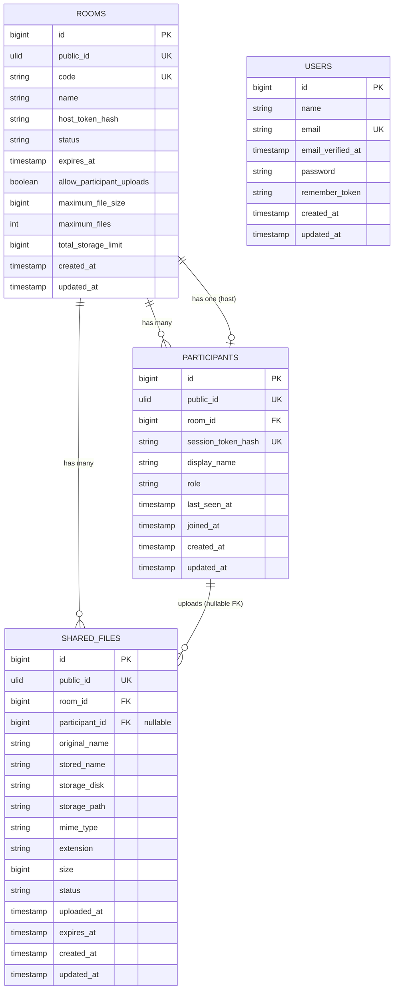
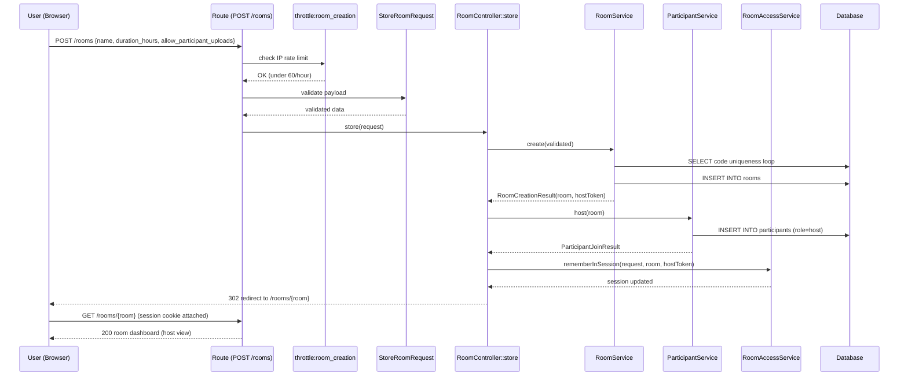
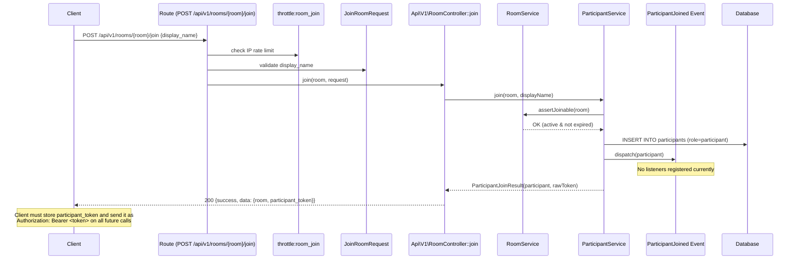
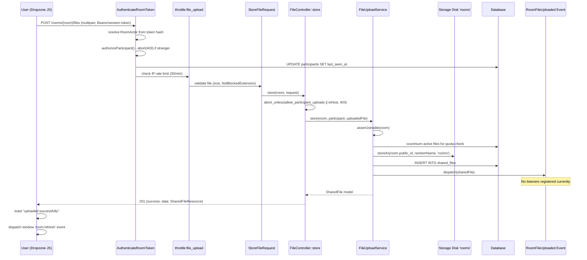
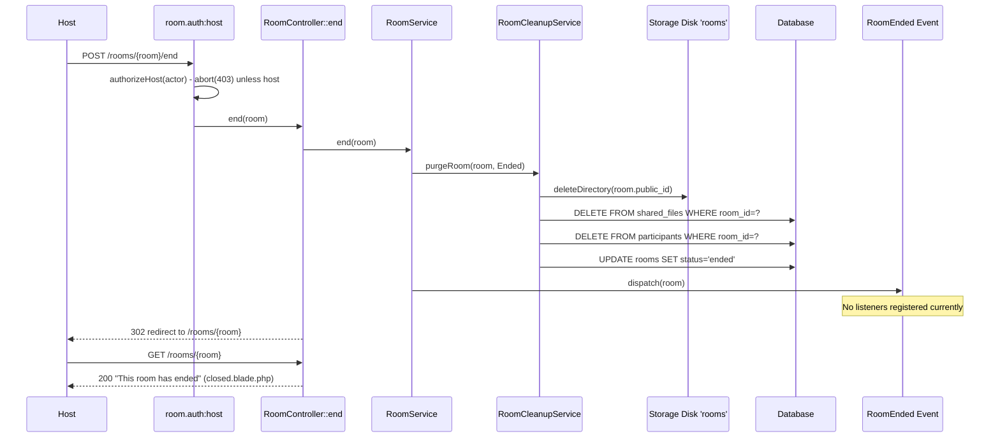
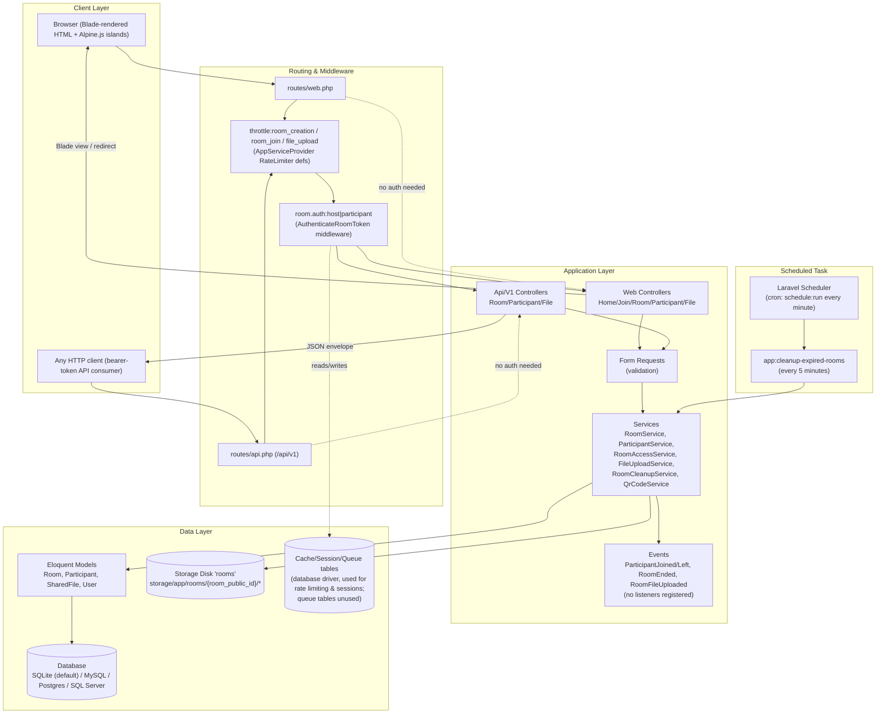

# Numas Share — Technical Project Documentation

> Generated by reading the project source code directly (Laravel 13 / PHP 8.3). No part of this document is speculative — every claim is traceable to a file path and, where relevant, a class/method name. Sections that could not be verified from code are explicitly flagged as **Unclear / Not present in code**.

---

## 1. Project Overview

### 1.1 What is this project?

**Numas Share** (`composer.json` package name is still the Laravel skeleton default `laravel/laravel`, but the app identifies itself as "Numas Share" in [resources/views/components/layouts/app.blade.php](resources/views/components/layouts/app.blade.php)) is a **temporary, account-free file-sharing web application**. A user creates an ephemeral "room," shares its code / link / QR code with other people, and everyone in that room can upload and download files until the room expires or the host manually ends it. There are no user accounts, no login, and no persistent identity — access to a room is governed entirely by possession of a **bearer token** (host token or participant token), not by a logged-in `User`.

### 1.2 What problem does it solve?

It solves the "AirDrop between strangers/across platforms" problem: two or more people who don't share a network, an account system, or a messaging app need to exchange files quickly, temporarily, and without signing up. Because rooms self-destruct (expire) and are cleaned up by a scheduled command, there is no long-term data retention burden.

### 1.3 How does it work (high level)?

1. Anyone visits `/` and clicks **Create a Room** (optionally setting a name, duration, and whether participants may upload). No login required.
2. The server creates a `Room` row, immediately also creates a `Participant` row with `role = host` for the creator, and returns a **host token** (a raw random string, only ever shown once, stored server-side only as a SHA-256 hash).
3. The host token is remembered in the **web session** for the web flow, so the browser doesn't need to resubmit it. API clients receive the token in the JSON response and must send it back as an `Authorization: Bearer <token>` header on every subsequent call.
4. The host shares the room's code, link, or QR code. Other people visit `/rooms/{room}`, see a join form (because they have no matching token yet), and submit a display name to become a `Participant` (`role = participant`).
5. Once inside, the room page polls `GET /rooms/{room}/state` every few seconds (`config('rooms.polling_interval_seconds')`, default 5s) to refresh the participant list, file list, and countdown — there is **no WebSocket/broadcasting**, this is plain HTTP polling driven by Alpine.js.
6. Any participant (if the host allows it) or the host can upload files via drag-and-drop or file picker; uploads go through an `XMLHttpRequest` so progress can be shown, hitting `POST /rooms/{room}/files`.
7. Files can be downloaded by anyone who has joined the room, and deleted by their uploader or the host.
8. The host can end the room early (`POST /rooms/{room}/end`), or the room expires automatically once `expires_at` passes. In both cases all files are deleted from disk and the DB, and all participants are removed — but the `Room` row itself is kept (as a status "tombstone": `ended` or `expired`) so that old links show a friendly "this room is closed" page instead of a raw 404.
9. A scheduled console command (`app:cleanup-expired-rooms`, run every 5 minutes — see [routes/console.php](routes/console.php)) performs step 8's cleanup for any room whose `expires_at` has silently passed without the host ending it.

### 1.4 Key Features

- Instant, account-free room creation with configurable duration (1/3/6/24 hours), optional name, optional upload permission toggle, and optional per-room file-size / file-count / total-storage overrides.
- Shareable room code (7-character, ambiguity-free alphabet), full link, short link (`/r/{room}`), and a generated QR code (PNG, via `endroid/qr-code`).
- Token-based access control that is **identical** across the web (Blade + session) and JSON API (`/api/v1/...`, bearer token) surfaces — both funnel through the same `RoomAccessService` and `AuthenticateRoomToken` middleware.
- Drag-and-drop file upload with per-file progress bars (`resources/js/alpine/upload-dropzone.js`).
- Live-feeling room dashboard via polling (participants, files, countdown, auto-reload when the room closes) — `resources/js/alpine/room-page.js`.
- File extension blocklist, per-file size limit, per-room file count limit, per-room total storage limit — all enforced server-side, all overridable per room, with sane global defaults in [config/rooms.php](config/rooms.php).
- Host-only room termination; host-only or self-only file deletion; host-only participant kicking (API only).
- IP-based rate limiting on room creation, room joining, and file uploads.
- Automatic expiry sweep via a scheduled Artisan command.
- Two parallel HTTP surfaces sharing all the same business logic: a **traditional server-rendered Blade/session flow** (`routes/web.php`) for the actual product UI, and a **versioned JSON API** (`routes/api.php`, prefixed `/api/v1`) for programmatic/bearer-token access (used internally by the dropzone/room-page JS via bearer token stored... actually see note below on the two flows).

> **Note (traceability nuance):** The web flow (`routes/web.php`) is **not** a thin wrapper around the API; it is a fully separate set of controllers (`App\Http\Controllers\*`) that happen to call the exact same `App\Services\*` classes as `App\Http\Controllers\Api\V1\*`. The two controller trees are documented separately in §8.

### 1.5 Who are the users?

There are exactly two logical actor types inside a room, resolved per-request by `RoomAccessService::resolveFromRequest()` into an `App\Support\RoomActor` value object:

| Actor | How identified | Capabilities |
|---|---|---|
| **Host** | Holds the room's `host_token` (hashed and compared against `rooms.host_token_hash`) | Everything a participant can do, plus: end the room, delete any file, (via API) kick any participant |
| **Participant** | Holds a `session_token` for that specific room (hashed and compared against `participants.session_token_hash`) | View room state, upload (if allowed), download files, delete own uploaded files, leave the room |
| **Stranger** | No token, or a token that matches neither host nor any participant | Can only view the public "join this room" form (`RoomController::show`) or hit unauthenticated endpoints (`store`, `qr`, `join`) |

There is also an `App\Models\User` model, `users` table, session/password-reset scaffolding, and an `auth.php` guard config — but **nothing in the application actually uses it**. No controller performs `Auth::login()`, no route is protected by the `auth` middleware, and `DatabaseSeeder` only creates one throwaway test user. This is Laravel's default starter-kit scaffolding left in place, unused by the room-sharing feature. See §14 for details.

### 1.6 User Journey

```mermaid
flowchart TD
    A[Visitor lands on '/'] -->|Create a Room| B[POST /rooms]
    B --> C[Room + Host Participant created]
    C --> D[Host token stored in session]
    D --> E[Redirect to /rooms/{room}]
    E --> F[Host sees dashboard: QR, link, participants, upload zone, file list]

    A -->|Has a code| G[GET /join]
    G --> H[POST /join with code]
    H -->|found| E
    H -->|not found| G

    I[Someone opens the room link directly] --> J[GET /rooms/{room}]
    J -->|no valid token yet| K[Join form shown]
    K -->|POST /rooms/{room}/join with display name| L[Participant created, token stored in session]
    L --> F

    F --> M[Upload files via dropzone]
    F --> N[Download files]
    F --> O{Host?}
    O -->|yes| P[POST /rooms/{room}/end]
    O -->|no| Q[POST /rooms/{room}/leave]
    P --> R[Room, files, participants purged; status=ended]
    Q --> S[Participant removed, redirected home]

    T[Scheduler: every 5 min] --> U[app:cleanup-expired-rooms]
    U --> V[Any room past expires_at is purged; status=expired]
```

### 1.7 Most Important Operations

1. **Room creation** — [app/Services/RoomService.php](app/Services/RoomService.php) `RoomService::create()`
2. **Joining a room** — [app/Services/ParticipantService.php](app/Services/ParticipantService.php) `ParticipantService::join()`
3. **Access resolution / authorization** — [app/Services/RoomAccessService.php](app/Services/RoomAccessService.php), enforced by [app/Http/Middleware/AuthenticateRoomToken.php](app/Http/Middleware/AuthenticateRoomToken.php)
4. **File upload (with quota enforcement)** — [app/Services/FileUploadService.php](app/Services/FileUploadService.php) `FileUploadService::store()`
5. **Room termination / expiry cleanup** — [app/Services/RoomCleanupService.php](app/Services/RoomCleanupService.php) `RoomCleanupService::purgeRoom()` / `purgeExpiredRooms()`

### 1.8 Architecture Overview (as implemented)

The project is a standard Laravel monolith: server-rendered Blade views enhanced with Alpine.js "islands" for interactivity, plus a parallel JSON API. There is no SPA framework (no Vue/React/Inertia), no separate frontend build target beyond Vite bundling CSS/JS, and no WebSocket layer.

```
Client (Browser: Blade + Alpine.js, or any HTTP client for the API)
    │
    ▼
routes/web.php  ──or──  routes/api.php  (prefix /api/v1)
    │
    ▼
Middleware
  • 'throttle:<limiter>'  (room_creation | room_join | file_upload — RateLimiter defs in AppServiceProvider)
  • 'room.auth:<host|participant|any>'  → App\Http\Middleware\AuthenticateRoomToken
    │
    ▼
Form Request validation (App\Http\Requests\*)  — runs before the controller method body executes
    │
    ▼
Controller (App\Http\Controllers\* for web, App\Http\Controllers\Api\V1\* for API)
    │
    ▼
Service / Business Logic (App\Services\*)
  RoomService · ParticipantService · RoomAccessService · FileUploadService · RoomCleanupService · QrCodeService
    │
    ▼
Model (App\Models\*: Room, Participant, SharedFile, User) — Eloquent ORM
    │
    ▼
Database (SQLite by default, MySQL/Postgres/SQL Server supported via config/database.php)
    +
Storage disk 'rooms' (local disk, storage/app/rooms/{room->public_id}/{stored_name})
    │
    ▼
Events dispatched at key points (App\Events\*) — currently have NO listeners wired up
    │
    ▼
Response
  • Web: Blade view or redirect (+ flash session errors)
  • API: JSON envelope via App\Support\ApiResponse ({success, message, data|errors})
```

---

## 2. Project Structure

```
numas-share/
├── app/
│   ├── Console/Commands/        Scheduled/CLI commands (CleanupExpiredRooms)
│   ├── Enums/                   Backed string enums: FileStatus, ParticipantRole, RoomStatus
│   ├── Events/                  Plain dispatchable events (no listeners registered)
│   ├── Exceptions/               RoomException base + 3 domain exceptions, rendered centrally in bootstrap/app.php
│   ├── Http/
│   │   ├── Controllers/          Web controllers (HomeController, JoinController, RoomController, ParticipantController, FileController)
│   │   │   └── Api/V1/           JSON API controllers, mirror the web controllers' actions
│   │   ├── Middleware/           AuthenticateRoomToken (aliased 'room.auth')
│   │   ├── Requests/              Form Request validation classes, grouped by domain (File/, Participant/, Room/)
│   │   ├── Resources/            JsonResource transformers (RoomResource, RoomStateResource, ParticipantResource, SharedFileResource)
│   │   └── Traits/               ApiResponseTrait (success()/error() helpers for API controllers)
│   ├── Models/
│   │   ├── Concerns/HasPublicId.php   Trait: ULID public_id generation + route-model-binding key
│   │   ├── Room.php, Participant.php, SharedFile.php, User.php
│   ├── Providers/AppServiceProvider.php   Registers rate limiters + the Request::roomActor() macro
│   ├── Rules/NotBlockedExtension.php      Custom validation rule (extension blocklist)
│   ├── Services/                  All business logic: RoomService, ParticipantService, RoomAccessService,
│   │                              FileUploadService, RoomCleanupService, QrCodeService
│   └── Support/                   Small immutable value/DTO objects: ApiResponse, RoomActor,
│                                  RoomCreationResult, ParticipantJoinResult
├── bootstrap/
│   ├── app.php                    Application bootstrap: registers routes, middleware alias, and ALL
│   │                              exception→response rendering logic (this is where JSON vs HTML error
│   │                              responses are decided — see §29)
│   └── providers.php               Lists AppServiceProvider
├── config/                        Standard Laravel config, plus custom config/rooms.php (see §31)
├── database/
│   ├── factories/                 Model factories used only by tests (RoomFactory, ParticipantFactory,
│   │                              SharedFileFactory, UserFactory)
│   ├── migrations/                6 migration files (see §3)
│   ├── seeders/DatabaseSeeder.php Creates one throwaway test@example.com user
│   └── database.sqlite            The actual SQLite database file used in local/dev
├── public/                        Web root (public/index.php is the front controller)
├── resources/
│   ├── css/app.css                Tailwind v4 entry point + custom brand color theme
│   ├── js/
│   │   ├── app.js                 Boots Alpine.js, imports the 4 alpine/* modules
│   │   ├── format.js               formatSize() helper shared by two Alpine components
│   │   └── alpine/                 countdown.js, room-page.js, toasts.js, upload-dropzone.js
│   └── views/
│       ├── components/layouts/app.blade.php    Base HTML shell (toasts, <title>, @vite)
│       ├── components/room/                     qr-code.blade.php, upload-dropzone.blade.php
│       ├── components/ui/countdown.blade.php
│       ├── errors/                              403, 404, 419, 500 custom error pages
│       ├── home.blade.php, join.blade.php
│       └── rooms/show.blade.php, rooms/closed.blade.php
├── routes/
│   ├── web.php                    All Blade/session-based routes (no /api prefix)
│   ├── api.php                    All JSON routes, mounted under /api/v1 (Laravel auto-prefixes /api)
│   └── console.php                Artisan 'inspire' + the cleanup command's schedule
├── storage/app/rooms/              Actual uploaded file storage root (disk 'rooms', see config/filesystems.php)
├── tests/
│   ├── Feature/                   9 feature test files + 1 scaffold ExampleTest — see §34
│   ├── Unit/ExampleTest.php       Scaffold only, no real unit tests
│   └── Pest.php                   Pest bootstrap: binds Feature tests to RefreshDatabase, and defines
│                                  3 reusable test helpers: createHostedRoom(), joinAsParticipant(), bearer()
├── composer.json / package.json    Backend/frontend dependency manifests (see §33)
└── vite.config.js                  Vite build config (Tailwind v4 plugin, Bunny Fonts plugin)
```

**Notably absent** (verified by directory listing — not present anywhere in `app/`): `app/Jobs`, `app/Listeners`, `app/Policies`, `app/Notifications`, `app/Broadcasting`. The project does not use queued jobs, event listeners, Laravel policies/gates, or notifications. See the relevant sections below for confirmation and what this implies.

---

## 3. Complete Database Documentation

The default connection is **SQLite** (`config/database.php` → `'default' => env('DB_CONNECTION', 'sqlite')`, file at `database/database.sqlite`), but MySQL/MariaDB/Postgres/SQL Server are all pre-configured and selectable via `.env`. There are **6 migration files**, creating **11 tables** total. Three tables (`rooms`, `participants`, `shared_files`) are the actual application domain; the other 8 are Laravel framework scaffolding (auth, cache, queue).

### 3.1 `rooms`

**Migration:** [database/migrations/2026_08_03_000001_create_rooms_table.php](database/migrations/2026_08_03_000001_create_rooms_table.php)
**Model:** [app/Models/Room.php](app/Models/Room.php)

The central entity. Represents one temporary file-sharing session. A room is never hard-deleted by application code — it transitions through `status` values and is kept as a historical/tombstone record (see §3.9 for the intentional absence of Laravel Soft Deletes here).

| Column | Type | Nullable | Default | Key | Description |
|---|---|---|---|---|---|
| `id` | bigint unsigned, auto-increment | No | — | PK | Internal numeric identity. Never exposed externally. |
| `public_id` | ulid (string, 26 chars) | No | generated on create | Unique | External-facing identifier. Set by `HasPublicId` trait's `creating` hook (`Str::ulid()`). Used as the **route model binding key** (`#[RouteKey('public_id')]` on the model) — every `{room}` URL segment is actually this ULID, not the numeric `id`. |
| `code` | string(8) | No | — | Unique | Human-typeable join code, 7 characters from `config('rooms.code.alphabet')` (ambiguity-free: excludes `0/O`, `1/I/L`). Generated by `RoomService::generateUniqueCode()`, which loops with `random_int()` until a DB-unique code is found. |
| `name` | string(100) | Yes | `null` | — | Optional user-supplied display name for the room (e.g. "Classroom 204"). |
| `host_token_hash` | string(64) | No | — | — | SHA-256 hex digest of the host's raw bearer token. The raw token itself is **never stored** — only ever returned once, at creation time, to the creator. `#[Hidden(['host_token_hash'])]` on the model prevents it leaking through `RoomResource`/`toArray()`/API responses even if someone forgot to use a Resource. |
| `status` | string(20) | No | `'active'` | Indexed | Cast to `App\Enums\RoomStatus` (`active`, `ended`, `expired`). Drives whether the room dashboard or the "closed" page is shown. |
| `expires_at` | timestamp | No | — | Indexed | Computed at creation as `now()->addHours(duration_hours)` (`RoomService::computeExpiresAt()`). Compared against `now()` on every access to decide if the room is still joinable/usable. |
| `allow_participant_uploads` | boolean | No | `true` (DB default; **application default is actually `false`** — see note below) | — | Whether non-host participants may upload files. Host can always upload regardless of this flag. |
| `maximum_file_size` | bigint unsigned | Yes | `null` | — | Per-room override (bytes) of the global `config('rooms.uploads.max_file_size')` (100 MB). `null` means "use the config default." |
| `maximum_files` | int unsigned | Yes | `null` | — | Per-room override of `config('rooms.uploads.max_files_per_room')` (200). |
| `total_storage_limit` | bigint unsigned | Yes | `null` | — | Per-room override of `config('rooms.uploads.max_total_storage')` (1 GB). |
| `created_at` / `updated_at` | timestamp | Yes | — | — | Standard Eloquent timestamps. |

> **Discrepancy worth flagging:** the migration sets the SQL column default for `allow_participant_uploads` to `true`, but `RoomService::create()` (app/Services/RoomService.php:27) sets it explicitly to `$data['allow_participant_uploads'] ?? false` whenever a room is created through the application — meaning **every room created through the app defaults to uploads disabled for participants** unless the creator explicitly checks the "Allow participants to upload files" box (which, confusingly, **is** checked by default in the create-room form UI, `resources/views/home.blade.php:59`, via a plain HTML checkbox with `checked` and `value="1"`). Net effect in practice: because the checkbox is present and checked, the form submits `allow_participant_uploads=1` on a normal submit, so the DB column's own default rarely matters — but if the field is ever omitted from a request payload (e.g. a bare API call), the effective default is `false`, not the column's `true`. Document this for the new developer since it is a genuine gotcha.

**Scopes** (query scopes defined on the model, see §6.1): `active()`, `expired()`.

### 3.2 `participants`

**Migration:** [database/migrations/2026_08_03_000002_create_participants_table.php](database/migrations/2026_08_03_000002_create_participants_table.php)
**Model:** [app/Models/Participant.php](app/Models/Participant.php)

Represents one person's membership in one room — the host included (the host is simply a `Participant` row with `role = host`, created automatically alongside the room).

| Column | Type | Nullable | Default | Key | Description |
|---|---|---|---|---|---|
| `id` | bigint unsigned, auto-increment | No | — | PK | Internal identity. |
| `public_id` | ulid | No | generated on create | Unique | External identifier (route-model-binding key), same mechanism as `rooms.public_id`. |
| `room_id` | bigint unsigned | No | — | FK → `rooms.id`, `cascadeOnDelete()` | Which room this participant belongs to. If a `Room` row were ever hard-deleted, all its participants would cascade-delete too (in practice, rooms are never hard-deleted — see §3.9). |
| `session_token_hash` | string(64) | No | — | **Unique** | SHA-256 hash of the participant's raw session token. Uniqueness is enforced at the DB level, guaranteeing no two participants (even across rooms) can ever collide on a token hash. |
| `display_name` | string(50) | No | — | — | User-chosen name shown in the participant list and as file-uploader attribution. Sanitized in `JoinRoomRequest::prepareForValidation()` (`trim(strip_tags(...))`) before validation. |
| `role` | string(20) | No | `'participant'` | Composite index `(room_id, role)` | Cast to `App\Enums\ParticipantRole` (`host` \| `participant`). The composite index supports `Room::host()`'s `where('role', Host)` lookup efficiently. |
| `last_seen_at` | timestamp | Yes | `null` | — | Updated on every authenticated request via `ParticipantService::touchLastSeen()`, called from `AuthenticateRoomToken` middleware. Not currently used to auto-expire idle participants — informational only in the current codebase. |
| `joined_at` | timestamp | No | — | — | Set once, at creation, to `now()`. |
| `created_at` / `updated_at` | timestamp | Yes | — | — | Standard Eloquent timestamps. |

### 3.3 `shared_files`

**Migration:** [database/migrations/2026_08_03_000003_create_shared_files_table.php](database/migrations/2026_08_03_000003_create_shared_files_table.php)
**Model:** [app/Models/SharedFile.php](app/Models/SharedFile.php)

One row per uploaded file.

| Column | Type | Nullable | Default | Key | Description |
|---|---|---|---|---|---|
| `id` | bigint unsigned, auto-increment | No | — | PK | Internal identity. |
| `public_id` | ulid | No | generated on create | Unique | External identifier / route-model-binding key. |
| `room_id` | bigint unsigned | No | — | FK → `rooms.id`, `cascadeOnDelete()`; composite index `(room_id, status)` | Owning room. |
| `participant_id` | bigint unsigned | **Yes** | `null` | FK → `participants.id`, `nullOnDelete()` | Who uploaded it. Nullable **and** `nullOnDelete()` so that if a participant leaves/is kicked, their previously uploaded files are **not** deleted — they just lose their attribution (`SharedFileResource` falls back to `'Unknown'` for `uploader_name` when `participant` is null, see §6.4). |
| `original_name` | string(255) | No | — | — | The filename as the browser reported it (`UploadedFile::getClientOriginalName()`). Used for the `Content-Disposition` filename on download and displayed in the UI. |
| `stored_name` | string(255) | No | — | Hidden from API output | The actual on-disk filename: `Str::random(40) . '.' . $extension` — deliberately unguessable/unrelated to the original name, to avoid collisions and to avoid leaking the original filename via the storage path. |
| `storage_disk` | string(50) | No | — | Hidden from API output | Name of the Laravel filesystem disk the file lives on (always `'rooms'` in current code, via `config('rooms.disk')`, but stored per-row so a future switch to e.g. S3 doesn't orphan old rows). |
| `storage_path` | string(500) | No | — | Hidden from API output | Path within that disk: `{room->public_id}/{stored_name}`. |
| `mime_type` | string(150) | No | — | — | From `UploadedFile::getMimeType()`, falling back to `'application/octet-stream'`. |
| `extension` | string(20) | No | — | — | Lower-cased client-reported extension (or PHP-guessed extension, or `'bin'` as last resort). |
| `size` | bigint unsigned | No | — | — | Byte size, from `UploadedFile::getSize()`. Cast to `integer` on the model. Summed across a room's active files to enforce `total_storage_limit`. |
| `status` | string(20) | No | `'active'` | Composite index `(room_id, status)` | Cast to `App\Enums\FileStatus` (`active` \| `deleted`). Deletion is a **soft, app-level status flip**, not Eloquent SoftDeletes (see §3.9) — `FileUploadService::delete()` sets this to `Deleted` (after actually removing the underlying disk file). |
| `uploaded_at` | timestamp | No | — | — | Set to `now()` at upload time. |
| `expires_at` | timestamp | Yes | `null` | Indexed | Set to the **room's** `expires_at` at upload time (a snapshot, not a live reference — if the room's expiry were ever extended, existing files' `expires_at` would not automatically follow). Not currently read anywhere else in the codebase besides being stored — actual expiry enforcement happens at the room level, not per-file. |
| `created_at` / `updated_at` | timestamp | Yes | — | — | Standard Eloquent timestamps. |

**Scope:** `active()` — `where('status', FileStatus::Active)`. Used everywhere a file list should exclude deleted rows (`RoomStateResource`, `Api\V1\FileController::index`, quota calculations in `FileUploadService::assertWithinLimits`).

### 3.4 `users`

**Migration:** [database/migrations/0001_01_01_000000_create_users_table.php](database/migrations/0001_01_01_000000_create_users_table.php)
**Model:** [app/Models/User.php](app/Models/User.php)

Standard Laravel starter-kit `users` table (`id`, `name`, `email` unique, `email_verified_at`, `password`, `remember_token`, timestamps). **Not used by any room-sharing feature** — see §14 for the full authentication analysis. Included here for completeness since the table and model do exist in the codebase.

### 3.5 `password_reset_tokens`

Created in the same migration as `users` (`email` primary key, `token`, `created_at`). Laravel default password-reset scaffolding. Unused (no password-reset routes/controllers exist anywhere in `routes/` or `app/Http/Controllers`).

### 3.6 `sessions`

Created in the same migration as `users`. Backs the **database** session driver (`SESSION_DRIVER=database` in `.env.example`). This table is actively used — it's how the web flow's host/participant tokens are persisted between requests (`RoomAccessService::rememberInSession()` writes into `$request->session()`, which is backed by this table).

| Column | Type | Notes |
|---|---|---|
| `id` | string, PK | Session ID (cookie value). |
| `user_id` | bigint unsigned, nullable, indexed | Would link to `users.id` if Laravel's auth guard were used — always `null` in this app since there's no login. |
| `ip_address` | string(45), nullable | |
| `user_agent` | text, nullable | |
| `payload` | longtext | Serialized session data — this is where `rooms.{public_id}.token` keys actually live (see §14.4). |
| `last_activity` | int, indexed | Unix timestamp, used for session garbage collection. |

### 3.7 `cache` / `cache_locks`

**Migration:** [database/migrations/0001_01_01_000001_create_cache_table.php](database/migrations/0001_01_01_000001_create_cache_table.php). Backs the **database** cache driver (`CACHE_STORE=database`). `cache` stores key/value/expiration; `cache_locks` supports atomic cache locks. Also used by Laravel's `RateLimiter` facade for tracking throttle attempt counts (see §13) — rate limiting hits are stored via the cache store, so with the default config this data lands in the `cache` table.

### 3.8 `jobs` / `job_batches` / `failed_jobs`

**Migration:** [database/migrations/0001_01_01_000002_create_jobs_table.php](database/migrations/0001_01_01_000002_create_jobs_table.php). Backs the **database** queue driver (`QUEUE_CONNECTION=database`). **No code in `app/` ever dispatches a queued job** (no `ShouldQueue` implementations, no `app/Jobs` directory at all) — these tables exist purely as unused framework scaffolding, ready for future use. See §20.

### 3.9 Deliberate design notes: no Soft Deletes, no hard deletes of Rooms

- **`Room` rows are never deleted.** `RoomCleanupService::purgeRoom()` deletes the room's *files* (`$room->files()->delete()` — a real hard DELETE on `shared_files` rows) and *participants* (`$room->participants()->delete()` — hard DELETE on `participants` rows), then flips the room's own `status` to `Ended` or `Expired` and saves it. The `Room` row persists indefinitely. This is intentional: `RoomController::show()` / `Api\V1\RoomController::show()` check `$room->status !== Active` and render a "closed" page (`resources/views/rooms/closed.blade.php`) rather than a 404, giving visitors of an old link a clear explanation instead of a broken link.
- **No Eloquent `SoftDeletes` trait is used anywhere** in the codebase (verified — none of the three domain models import or use the `SoftDeletes` trait, and none of their migrations have a `deleted_at` column). `SharedFile.status` (`active`/`deleted`) is a hand-rolled equivalent of soft-deletion, but it's a plain enum column, not Eloquent's soft-delete mechanism — meaning global query scopes do **not** automatically exclude deleted files; every query that should skip deleted files must explicitly call the `active()` local scope.
- **`Participant` rows genuinely hard-delete** on leave/kick (`ParticipantService::leave()` calls `$participant->delete()`), with no status column at all — a participant either exists or doesn't.

---

## 4. Database Relationships

| Relationship | Type | Source Model | Target Model | Foreign Key | Why it exists | Where it's used |
|---|---|---|---|---|---|---|
| Room → Participants | `hasMany` | `Room` ([app/Models/Room.php:42](app/Models/Room.php)) | `Participant` | `participants.room_id` | A room contains many people (host + joiners). | `RoomStateResource` lists all participants; `RoomCleanupService` bulk-deletes them; `RoomAccessService::resolveFromRequest()` looks up a participant by hash within `$room->participants()`. |
| Room → SharedFiles | `hasMany` | `Room` ([app/Models/Room.php:47](app/Models/Room.php)) | `SharedFile` | `shared_files.room_id` | A room contains many uploaded files. | `RoomStateResource` / `Api\V1\FileController::index` list active files; `FileUploadService::assertWithinLimits()` counts/sums them for quota checks; `RoomCleanupService` bulk-deletes them. |
| Room → Host (Participant) | `hasOne` (constrained) | `Room` ([app/Models/Room.php:52](app/Models/Room.php)) | `Participant` | `participants.room_id` where `role = host` | Convenience accessor to fetch the single host participant without a manual query — every room has exactly one host. | `RoomAccessService::resolveFromRequest()` uses `$room->host` to build the `RoomActor` when a request's token matches the host hash. |
| Participant → Room | `belongsTo` | `Participant` ([app/Models/Participant.php:38](app/Models/Participant.php)) | `Room` | `participants.room_id` | Inverse of Room→Participants; a participant needs to reach its room (e.g. to check `room.status`, or for the `ParticipantLeft` event payload). | `ParticipantService::leave()` reads `$participant->room` before deleting the participant, to pass the room into the `ParticipantLeft` event. |
| Participant → SharedFiles | `hasMany` | `Participant` ([app/Models/Participant.php:43](app/Models/Participant.php)) | `SharedFile` | `shared_files.participant_id` | Track everything a given person uploaded. | Not directly queried anywhere in current controllers/services (uploader attribution instead goes the other direction, `SharedFile → Participant`), but exists as the logical inverse and is available for future features (e.g. "my uploads"). |
| SharedFile → Room | `belongsTo` | `SharedFile` ([app/Models/SharedFile.php:41](app/Models/SharedFile.php)) | `Room` | `shared_files.room_id` | A file needs to confirm/derive its room (e.g. building the `download_url`). | `SharedFileResource::toArray()` calls `$this->room->public_id` to build the download URL. |
| SharedFile → Participant (uploader) | `belongsTo`, nullable | `SharedFile` ([app/Models/SharedFile.php:46](app/Models/SharedFile.php)) | `Participant` | `shared_files.participant_id` | Attribute a file to its uploader for display, and to authorize "only the uploader or host may delete." | `SharedFileResource` (`uploader_id`, `uploader_name`); `FileController::destroy` / `Api\V1\FileController::destroy` (`$actor->participant?->id === $file->participant_id`). |

No relationships involve `User` — the `users` table is entirely disconnected from the `rooms`/`participants`/`shared_files` graph.

### 4.1 ER Diagram



> `USERS` is drawn with no relationship lines because, as confirmed in §3.4 and §14, it is unconnected to the room domain in the current codebase.

---

## 5. Models Documentation

All four models live in `app/Models/`. Three of them (`Room`, `Participant`, `SharedFile`) share a common trait, `HasPublicId`, documented first since it underpins route-model binding across the entire app.

### 5.0 `App\Models\Concerns\HasPublicId` (trait)

**File:** [app/Models/Concerns/HasPublicId.php](app/Models/Concerns/HasPublicId.php)

Not a model itself, but used by `Room`, `Participant`, and `SharedFile`. Provides two things:

- **`bootHasPublicId()`** — a static Eloquent boot method, auto-called by Laravel because it follows the `boot{TraitName}` convention. Registers a `creating` model event listener that assigns `$model->public_id ??= (string) Str::ulid();` — i.e., generates a sortable, unique ULID string the moment the row is about to be inserted, but only if `public_id` wasn't already set (defensive `??=`, though nothing in the codebase ever sets it manually).
- **`getRouteKeyName(): string`** — overrides Eloquent's default so that implicit route-model binding (`Route::get('/rooms/{room}', ...)` binding a `Room $room` argument) resolves by `public_id` instead of the numeric `id`. This is why every URL in the app contains a ULID (e.g. `/rooms/01HXYZ.../state`) rather than a small sequential integer — deliberately unguessable, so room/file/participant IDs can't be enumerated.

### 5.1 `Room`

**File:** [app/Models/Room.php](app/Models/Room.php)
**Purpose:** Represents one file-sharing session/room — the aggregate root of the whole domain.
**Table:** `rooms` (§3.1)
**Primary Key:** `id` (auto-increment); **route key** is `public_id` (via `HasPublicId`).
**Fillable** (via PHP attribute `#[Fillable([...])]`, not the classic `protected $fillable` array — same effect, Laravel 13 attribute-based syntax): `name`, `code`, `host_token_hash`, `status`, `expires_at`, `allow_participant_uploads`, `maximum_file_size`, `maximum_files`, `total_storage_limit`.
**Guarded:** Not declared (Fillable attribute is the mass-assignment mechanism in use; there is no `$guarded` in this model).
**Hidden:** `host_token_hash` (via `#[Hidden(['host_token_hash'])]`) — guarantees the hashed token never serializes into JSON output even through an accidental `$room->toArray()`.
**Casts** (`casts()` method, Laravel's newer method-based cast declaration):
- `status` → `App\Enums\RoomStatus` (backed enum)
- `allow_participant_uploads` → `boolean`
- `expires_at` → `datetime` (Carbon instance)

**Factory:** `Database\Factories\RoomFactory` (bound via `#[UseFactory(RoomFactory::class)]`).

**Relationships:**
- `participants(): HasMany` → `Participant` (§4)
- `files(): HasMany` → `SharedFile` (§4)
- `host(): HasOne` → `Participant`, constrained `where('role', ParticipantRole::Host)` (§4)

**Scopes:**
- `#[Scope] protected function active(Builder $query): void` — adds `where('status', RoomStatus::Active)`. Called as `Room::active()`. Used by `RoomCleanupService::purgeExpiredRooms()` (`Room::active()->expired()->get()`).
- `#[Scope] protected function expired(Builder $query): void` — adds `where('expires_at', '<=', now())`. Same caller as above. Note: this scope checks *time*, independent of `status` — it's the `active()` scope that narrows to currently-active rooms; combining both scopes is how the cleanup command finds rooms that are still marked `active` in the DB but whose time has actually run out.

**Methods:** No custom instance methods beyond the relationships/scopes above — all room *behavior* (creation, expiry checks, ending) lives in `RoomService`, not on the model itself. This is a deliberate "thin model, service owns behavior" design consistently applied across the codebase.

### 5.2 `Participant`

**File:** [app/Models/Participant.php](app/Models/Participant.php)
**Purpose:** Represents one person's membership in a room (host or regular participant).
**Table:** `participants` (§3.2)
**Primary Key:** `id`; route key `public_id`.
**Fillable:** `room_id`, `session_token_hash`, `display_name`, `role`, `last_seen_at`, `joined_at`.
**Hidden:** `session_token_hash`.
**Casts:** `role` → `App\Enums\ParticipantRole`; `last_seen_at` → `datetime`; `joined_at` → `datetime`.
**Factory:** `Database\Factories\ParticipantFactory`.

**Relationships:**
- `room(): BelongsTo` → `Room`
- `files(): HasMany` → `SharedFile`

**Methods:**
- **`isHost(): bool`** — returns `$this->role === ParticipantRole::Host`. This is the single source of truth for "is this participant the host," called from `App\Support\RoomActor::isHost()` (which just delegates: `$this->participant?->isHost() ?? false`), and directly by `FileController`/`Api\V1\FileController` when checking upload/delete permissions (e.g. `abort_unless($room->allow_participant_uploads || $actor->isHost(), ...)`).

### 5.3 `SharedFile`

**File:** [app/Models/SharedFile.php](app/Models/SharedFile.php)
**Purpose:** Represents one uploaded file's metadata (the actual bytes live on the `rooms` storage disk; this row is only metadata).
**Table:** `shared_files` (§3.3)
**Primary Key:** `id`; route key `public_id`.
**Fillable:** `room_id`, `participant_id`, `original_name`, `stored_name`, `storage_disk`, `storage_path`, `mime_type`, `extension`, `size`, `status`, `uploaded_at`, `expires_at`.
**Hidden:** `storage_disk`, `storage_path`, `stored_name` — these three are internal storage-layer details never meant to be exposed to clients (they'd leak the physical file layout and unguessable-but-still-sensitive stored filename).
**Casts:** `status` → `App\Enums\FileStatus`; `size` → `integer`; `uploaded_at` → `datetime`; `expires_at` → `datetime`.
**Factory:** `Database\Factories\SharedFileFactory`.

**Relationships:**
- `room(): BelongsTo` → `Room`
- `participant(): BelongsTo` → `Participant` (nullable — see §3.3/§4)

**Scopes:**
- `#[Scope] protected function active(Builder $query): void` — `where('status', FileStatus::Active)`. Called everywhere a file listing or quota calculation must ignore soft-"deleted" files (`RoomStateResource`, `Api\V1\FileController::index`, `FileUploadService::assertWithinLimits`).

**Methods:** None beyond relationships/scope — all file behavior (storing, downloading, deleting, quota checks) lives in `FileUploadService`.

### 5.4 `User`

**File:** [app/Models/User.php](app/Models/User.php)
**Purpose:** Laravel's default authenticatable user model, part of the framework starter kit. **Not used by any feature of this application** (see §14 for the full analysis of why it exists but is inert).
**Table:** `users` (§3.4)
**Primary Key:** `id` (standard auto-increment, no `HasPublicId` — this model predates/is unrelated to the room domain's public-ID convention).
**Fillable:** `name`, `email`, `password`.
**Hidden:** `password`, `remember_token`.
**Casts:** `email_verified_at` → `datetime`; `password` → `hashed` (Laravel automatically hashes on assignment).
**Traits:** `HasFactory`, `Notifiable` (from `Illuminate\Notifications\Notifiable` — enables `$user->notify(...)`, but nothing in the app ever calls it).
**Relationships:** None declared, and none exist to `Room`/`Participant`/`SharedFile`.
**Methods:** None beyond framework defaults (`Authenticatable` base class methods like `getAuthPassword()` etc., inherited, not overridden).

---

## 6. Routes Documentation

There are **13 web routes** ([routes/web.php](routes/web.php)) and **12 API routes** ([routes/api.php](routes/api.php), all under the `/api/v1` prefix and `api.v1.` route-name prefix — the prefixing is applied by `Route::prefix('v1')->name('api.v1.')->group(...)` inside `routes/api.php`, and Laravel's routing bootstrap in [bootstrap/app.php](bootstrap/app.php) additionally mounts the whole file under `/api`). One extra route (`GET /up`) is Laravel's built-in health-check endpoint, registered by `health: '/up'` in `bootstrap/app.php` — it is framework infrastructure, not application code, and is not detailed further.

### 6.1 Web Routes — [routes/web.php](routes/web.php)

| Method | URL | Name | Controller::Method | Middleware | Purpose |
|---|---|---|---|---|---|
| GET | `/` | `home` | `HomeController::index` | — | Landing page: create-room form + join-by-code form. |
| POST | `/rooms` | `rooms.store` | `RoomController::store` | `throttle:room_creation` | Create a new room, auto-join creator as host, redirect into it. |
| GET | `/join` | `join.show` | `JoinController::show` | — | Standalone "enter a room code" page. |
| POST | `/join` | `join.store` | `JoinController::store` | `throttle:room_join` | Look up a room by its code and redirect to it (or show a "not found" error). |
| GET | `/rooms/{room}` | `rooms.show` | `RoomController::show` | — | The room dashboard (or join form, or closed page, depending on room/actor state). |
| GET | `/r/{room}` | `rooms.short` | `RoomController::shortLink` | — | Short/QR-friendly alias that redirects to `rooms.show`. |
| POST | `/rooms/{room}/join` | `rooms.join` | `ParticipantController::store` | `throttle:room_join` | Submit a display name to join the room as a participant. |
| POST | `/rooms/{room}/leave` | `rooms.leave` | `ParticipantController::destroy` | `room.auth:participant` | Leave the room (removes the caller's own Participant row). |
| POST | `/rooms/{room}/end` | `rooms.end` | `RoomController::end` | `room.auth:host` | Host-only: end the room immediately. |
| GET | `/rooms/{room}/state` | `rooms.state` | `RoomController::state` | `room.auth:participant` | JSON polling endpoint consumed by the Alpine `roomPage` component. |
| GET | `/rooms/{room}/qr` | `rooms.qr` | `RoomController::qr` | — | Streams a PNG QR code encoding the short link. |
| POST | `/rooms/{room}/files` | `rooms.files.store` | `FileController::store` | `room.auth:participant`, `throttle:file_upload` | Upload a file into the room. |
| GET | `/rooms/{room}/files/{file}/download` | `rooms.files.download` | `FileController::download` | `room.auth:participant` | Stream a file's bytes back to the caller. |
| DELETE | `/rooms/{room}/files/{file}` | `rooms.files.destroy` | `FileController::destroy` | `room.auth:participant` | Delete a file (uploader or host only). |

Every web route implicitly also passes through Laravel's default `web` middleware group (session, CSRF verification, cookie encryption, etc.) — this is applied automatically because these routes are declared in `routes/web.php`, per Laravel's routing conventions; it is **not** re-stated per-route in the file itself, but it is real and active (confirmed by every Blade form in the codebase including a `@csrf` token, and by `tests/Feature/RoomJoinTest.php` etc. asserting session-based error flashing).

### 6.2 API Routes — [routes/api.php](routes/api.php) (mounted at `/api/v1/...`)

| Method | URL | Name | Controller::Method | Middleware | Purpose |
|---|---|---|---|---|---|
| POST | `/api/v1/rooms` | `api.v1.rooms.store` | `Api\V1\RoomController::store` | `throttle:room_creation` | Create a room via API; returns room + host token in JSON. |
| GET | `/api/v1/rooms/{room}` | `api.v1.rooms.show` | `Api\V1\RoomController::show` | — | Fetch a room's public info. |
| POST | `/api/v1/rooms/{room}/join` | `api.v1.rooms.join` | `Api\V1\RoomController::join` | `throttle:room_join` | Join a room via API; returns a participant bearer token. |
| POST | `/api/v1/rooms/{room}/leave` | `api.v1.rooms.leave` | `Api\V1\RoomController::leave` | `room.auth:participant` | Leave a room via API. |
| POST | `/api/v1/rooms/{room}/end` | `api.v1.rooms.end` | `Api\V1\RoomController::end` | `room.auth:host` | Host-only: end a room via API. |
| GET | `/api/v1/rooms/{room}/state` | `api.v1.rooms.state` | `Api\V1\RoomController::state` | `room.auth:participant` | Same payload shape as the web polling endpoint. |
| GET | `/api/v1/rooms/{room}/participants` | `api.v1.participants.index` | `Api\V1\ParticipantController::index` | `room.auth:participant` | Paginated participant list (25/page... actually 50/page, see §8). |
| PATCH | `/api/v1/rooms/{room}/participants/{participant}` | `api.v1.participants.update` | `Api\V1\ParticipantController::update` | `room.auth:host` | Host-only: currently supports only `action=kick`. |
| GET | `/api/v1/rooms/{room}/files` | `api.v1.files.index` | `Api\V1\FileController::index` | `room.auth:participant` | Paginated active-file list. |
| POST | `/api/v1/rooms/{room}/files` | `api.v1.files.store` | `Api\V1\FileController::store` | `room.auth:participant`, `throttle:file_upload` | Upload a file via API. |
| GET | `/api/v1/rooms/{room}/files/{file}` | `api.v1.files.show` | `Api\V1\FileController::show` | `room.auth:participant` | Fetch one file's metadata. |
| GET | `/api/v1/rooms/{room}/files/{file}/download` | `api.v1.files.download` | `Api\V1\FileController::download` | `room.auth:participant` | Stream file bytes. |
| DELETE | `/api/v1/rooms/{room}/files/{file}` | `api.v1.files.destroy` | `Api\V1\FileController::destroy` | `room.auth:participant` | Delete a file. |

All API routes pass through Laravel's default `api` middleware group as well (rate limiter binding, etc., per Laravel convention for `routes/api.php`).

**On the `room.auth:<role>` parameter:** this is the `AuthenticateRoomToken` middleware (§12) receiving a string argument (`'host'`, `'participant'`, or the implicit default `'any'` when no argument is given, as on `GET /rooms/{room}/qr` — wait, `qr` actually has **no** `room.auth` middleware at all; it's publicly accessible by design, since the QR image itself only encodes a public short-link URL and reveals no secret). Full request-flow detail is in §9 and §12.

---

## 7. Controllers Documentation

There are **9 controller files**: 2 abstract base controllers and 7 concrete controllers with actions (5 web + a shared abstract base in `Api/V1`, plus the base app `Controller`). Every concrete controller is thin — validation is delegated to Form Requests, and all actual state mutation is delegated to `App\Services\*`. This section documents every file and every method.

### 7.0 Base Controllers

**`App\Http\Controllers\Controller`** — [app/Http/Controllers/Controller.php](app/Http/Controllers/Controller.php). Empty abstract base class; every other controller in the app extends this (directly or, for the API, indirectly).

**`App\Http\Controllers\Api\V1\Controller`** — [app/Http/Controllers/Api/V1/Controller.php](app/Http/Controllers/Api/V1/Controller.php). Abstract, extends the base `Controller`, and pulls in `App\Http\Traits\ApiResponseTrait`. Every `Api\V1\*` controller extends this instead of the base, which is how they all get `$this->success(...)` / `$this->error(...)` helpers (§7.5).

### 7.1 `HomeController`

**File:** [app/Http/Controllers/HomeController.php](app/Http/Controllers/HomeController.php)
**Responsibility:** Serve the landing page. No dependencies, no models, no services.

#### `HomeController::index()`
1. **Route:** `GET /` (`home`).
2. **Called by:** Any visitor loading the site root.
3. **Input:** None.
4. **Validation:** None.
5. **Body:** Single line — `return view('home');`.
6. **Models used:** None directly (the Blade view itself reads `config('rooms.durations')` and `config('rooms.default_duration')` to populate the duration `<select>`, and renders `$errors` from any redirected-back validation failure — e.g. after a failed `/rooms` or `/join` submission that redirected back to `/`... actually `RoomController::store` and `JoinController::store` both `back()` to whichever page issued the request, which for the landing page's own forms is `/`).
7. **Response:** Renders [resources/views/home.blade.php](resources/views/home.blade.php).

### 7.2 `JoinController`

**File:** [app/Http/Controllers/JoinController.php](app/Http/Controllers/JoinController.php)
**Responsibility:** The "I have a code" flow — look a room up by its short join code and redirect the user into it. No service dependency; the lookup is simple enough to stay in the controller (a design choice — not every operation gets a service, only ones with real business logic).

#### `JoinController::show()`
1. **Route:** `GET /join` (`join.show`).
2. **Called by:** The "Have a room code?" link/flow (also reachable directly).
3. **Body:** `return view('join');` — renders [resources/views/join.blade.php](resources/views/join.blade.php), a standalone code-entry form.

#### `JoinController::store(LookupRoomByCodeRequest $request)`
1. **Route:** `POST /join` (`join.store`), rate-limited by `throttle:room_join`.
2. **Called by:** Submitting the code form on `/join` or the landing page's inline join box.
3. **Input:** `code` (string).
4. **Validation:** `LookupRoomByCodeRequest` (§11.4) — required, string, exact length `config('rooms.code.length')` (7). `prepareForValidation()` upper-cases the submitted code before the rule runs, so lower-case input is normalized.
5. **Step-by-step:**
   a. `Room::where('code', $request->validated('code'))->first()` — a direct Eloquent lookup by the (unique-indexed) `code` column.
   b. If no room matches, `return back()->withErrors(['code' => 'No room was found with that code.'])->withInput();` — flashes an error and the submitted input back to whichever page the form was on.
   c. If found, `return redirect()->route('rooms.show', $room);` — Laravel automatically resolves `$room`'s route key (`public_id`, via `HasPublicId`) when generating this URL.
6. **Models used:** `Room` (read-only query, no writes).
7. **Events/Jobs:** None.
8. **Response (success):** 302 redirect to the room's dashboard URL.
9. **Response (failure):** 302 redirect back with a flashed `code` error, HTTP 302 (not a JSON error — this is a pure web-session flow, there is no API equivalent for `/join` by design, since the API expects clients to already know the room's `public_id` for `GET /api/v1/rooms/{room}`, or to have received it from a prior `store`/`join` call).

### 7.3 `RoomController` (Web)

**File:** [app/Http/Controllers/RoomController.php](app/Http/Controllers/RoomController.php)
**Dependencies (constructor-injected):** `RoomService $rooms`, `ParticipantService $participants`, `RoomAccessService $access`.
**Models used:** `Room` (via services and type-hinted route params).
**Services used:** `RoomService`, `ParticipantService`, `RoomAccessService`, and (method-injected) `QrCodeService`.
**Requests used:** `StoreRoomRequest`.
**Events:** Indirectly triggers `RoomEnded` (via `RoomService::end()`).

#### `RoomController::store(StoreRoomRequest $request)`
1. **Route:** `POST /rooms` (`rooms.store`), throttled by `throttle:room_creation`.
2. **Called by:** The "Create a Room" form on `/` ([resources/views/home.blade.php](resources/views/home.blade.php)).
3. **Input:** `name` (optional, ≤100 chars), `duration_hours` (optional, must be one of `config('rooms.durations')` = `[1, 3, 6, 24]`), `allow_participant_uploads` (optional boolean), `maximum_file_size`/`maximum_files`/`total_storage_limit` (optional integers, `min:1`).
4. **Validation:** `StoreRoomRequest` (§11.5), `authorize()` always returns `true` (no auth gate — anyone may create a room).
5. **Step-by-step:**
   a. `$result = $this->rooms->create($request->validated());` — delegates entirely to `RoomService::create()` (§17.1), which builds the `Room` row (generating a unique `code`, hashing a freshly random host token, computing `expires_at`) and returns an `App\Support\RoomCreationResult` DTO containing the persisted `Room` and the **raw** (unhashed) host token.
   b. `$this->participants->host($result->room);` — creates the host's `Participant` row (`role = host`, default display name `'Host'`) via `ParticipantService::host()` (§17.2), which internally reuses the same private `createParticipant()` helper as regular joins.
   c. `$this->access->rememberInSession($request, $result->room, $result->hostToken);` — stores the **raw** host token in the web session under a room-scoped key (`RoomAccessService::sessionKey()` → `"rooms.{$room->public_id}.token"`), so the browser doesn't need to manually resend it on every subsequent request to this room.
   d. `return redirect()->route('rooms.show', $result->room);`.
6. **Queries executed:** 1 INSERT into `rooms` (plus a `SELECT ... WHERE code = ?` loop inside code generation until a unique code is found — typically 1 query given the ~2×10¹⁰ combination space), 1 INSERT into `participants`.
7. **Records created:** 1 `Room`, 1 `Participant` (host).
8. **Files uploaded:** None.
9. **Events fired:** None at creation time (no `RoomCreated` event exists in the codebase — only `RoomEnded`, `ParticipantJoined`, `ParticipantLeft`, `RoomFileUploaded` exist; see §18).
10. **Returns:** 302 redirect.
11. **Success:** User lands on `/rooms/{room}` already authenticated as host (session already carries the token), sees the full dashboard immediately (not the join form) — confirmed by `tests/Feature/RoomCreationTest.php`'s "the host is redirected straight into the room dashboard" test.
12. **Failure:** A validation failure (e.g. `duration_hours` not in the allowed list) never reaches this method body at all — `StoreRoomRequest` throws `ValidationException` first, caught by the central exception renderer in `bootstrap/app.php`, which for a non-JSON request lets Laravel's default behavior take over (redirect back with `$errors` flashed — the web routes don't override `ValidationException` rendering for HTML requests, only for JSON, see §29).

#### `RoomController::show(Request $request, Room $room)`
1. **Route:** `GET /rooms/{room}` (`rooms.show`). No middleware — deliberately open to strangers, since this single action serves three very different states.
2. **Called by:** Anyone navigating to a room link (freshly created, shared, or bookmarked).
3. **Step-by-step:**
   a. If `$room->status !== RoomStatus::Active || $room->expires_at->isPast()`: render `rooms.closed` with `isExpired` computed as `$room->status === Expired || $room->expires_at->isPast()` (note: this treats a room that is *time-expired but not yet swept by the cleanup command* as "expired" for display purposes too, even though its DB `status` might still technically read `active` until the next scheduler tick — a deliberate consistency choice so the UI never shows an obviously-past-due room as live).
   b. Otherwise, `$actor = $this->access->resolveFromRequest($request, $room);` (§17.3) — determines whether the current browser/session is the host, an existing participant, or a stranger.
   c. `return view('rooms.show', ['room' => $room, 'actor' => $actor]);`.
4. **Models used:** `Room` (route-bound), `Participant` (indirectly, via `RoomAccessService`).
5. **Response:** One of two Blade views, both extending `x-layouts.app`:
   - [resources/views/rooms/closed.blade.php](resources/views/rooms/closed.blade.php) — for expired/ended rooms.
   - [resources/views/rooms/show.blade.php](resources/views/rooms/show.blade.php) — for active rooms; internally branches again on `$actor->isStranger()` to show either the join form or the full dashboard (Alpine component `roomPage`, hydrated with a JSON config blob built from `$room`/`$actor`).

#### `RoomController::shortLink(Room $room)`
1. **Route:** `GET /r/{room}` (`rooms.short`). This is the URL encoded into the QR code and used as the "shareable link" in the dashboard's copy-link box.
2. **Body:** `return redirect()->route('rooms.show', $room);` — a plain, unconditional 302 redirect. No auth/validation; the short link's only purpose is brevity for QR encoding and manual sharing.

#### `RoomController::end(Room $room)`
1. **Route:** `POST /rooms/{room}/end` (`rooms.end`), middleware `room.auth:host` — enforced *before* this method body runs; if the caller isn't the host, the middleware aborts with 403 and this code never executes.
2. **Called by:** The "End room" button in the dashboard (host-only UI, gated client-side too, but the real enforcement is server-side).
3. **Body:** `$this->rooms->end($room); return redirect()->route('rooms.show', $room);` — delegates entirely to `RoomService::end()` (§17.1), which purges files/participants, sets status to `Ended`, and dispatches `RoomEnded`.
4. **Response:** Redirects back to the same room URL, which — because the room's status is now `Ended` — immediately renders the "closed" page instead of the dashboard on the very next request. This is why there's no separate "room ended" view logic in this method itself; it reuses `show()`'s branching.

#### `RoomController::state(Room $room)`
1. **Route:** `GET /rooms/{room}/state` (`rooms.state`), middleware `room.auth:participant` — caller must be host or a joined participant.
2. **Called by:** `resources/js/alpine/room-page.js`'s `poll()` method, on an interval (`config('rooms.polling_interval_seconds')` = 5s) plus once immediately on page load and on a custom `room:refresh` browser event (fired after a successful upload or delete).
3. **Body:** `return ApiResponse::success(new RoomStateResource($room));` — wraps a `RoomStateResource` (§9.3) in the standard `{success, message, data}` envelope, **even on the web route** (this is the one web-flow endpoint that returns JSON, since it's consumed by JS, not rendered by the browser).
4. **Response shape:** `{success: true, message: '', data: {status, expires_at, seconds_remaining, allow_participant_uploads, participant_count, participants: [...], files: [...]}}`.

#### `RoomController::qr(Room $room, QrCodeService $qrCodes)`
1. **Route:** `GET /rooms/{room}/qr` (`rooms.qr`). **No auth middleware** — publicly accessible by design, since the QR code only encodes the (already-public, guessable-only-if-you-have-the-link) short URL, not any secret.
2. **Called by:** The `` in [resources/views/components/room/qr-code.blade.php](resources/views/components/room/qr-code.blade.php), and the "Download QR" link (same URL, with `download` attribute).
3. **Body:** `$png = $qrCodes->generate(route('rooms.short', $room)); return response($png, 200)->header('Content-Type', 'image/png');` — delegates PNG generation to `QrCodeService` (§17.6, wraps `endroid/qr-code`), 320×320px with 12px margin.
4. **Response:** Raw PNG binary, `Content-Type: image/png`.

### 7.4 `ParticipantController` (Web)

**File:** [app/Http/Controllers/ParticipantController.php](app/Http/Controllers/ParticipantController.php)
**Dependencies:** `ParticipantService $participants`, `RoomAccessService $access`.

#### `ParticipantController::store(Room $room, JoinRoomRequest $request)`
1. **Route:** `POST /rooms/{room}/join` (`rooms.join`), throttled by `throttle:room_join`.
2. **Called by:** The join form shown to strangers on `/rooms/{room}` ([resources/views/rooms/show.blade.php](resources/views/rooms/show.blade.php)).
3. **Input:** `display_name` (required string, 1–50 chars; sanitized via `trim(strip_tags(...))` in `JoinRoomRequest::prepareForValidation()`).
4. **Step-by-step:**
   a. `$result = $this->participants->join($room, $request->validated('display_name'));` — `ParticipantService::join()` (§17.2) first calls `RoomService::assertJoinable($room)` (throws `RoomNotJoinableException`, HTTP 410, if the room isn't `Active` or is past `expires_at`), then creates the `Participant` row and dispatches `ParticipantJoined`.
   b. `$this->access->rememberInSession($request, $room, $result->sessionToken);` — stores the raw participant token in session, room-scoped.
   c. `return redirect()->route('rooms.show', $room);`.
5. **Models used:** `Room`, `Participant`.
6. **Events fired:** `ParticipantJoined` (§18.1).
7. **Success:** Redirects into the now-joined dashboard.
8. **Failure paths:**
   - Validation failure (empty display name) → redirect back with `display_name` error (confirmed by `RoomJoinTest.php`).
   - Room not joinable (expired/ended) → `RoomNotJoinableException` is thrown, caught by the central renderer in `bootstrap/app.php`; for a non-JSON request this becomes `back()->withErrors(['error' => $message])->withInput()` (confirmed by `RoomJoinTest.php`'s `assertSessionHasErrors('error')` assertions).

#### `ParticipantController::destroy(Room $room, Request $request)`
1. **Route:** `POST /rooms/{room}/leave` (`rooms.leave`), middleware `room.auth:participant`.
2. **Called by:** The "Leave room" button (non-host dashboard view).
3. **Body:**
   a. `$actor = $request->roomActor();` — reads the `RoomActor` that `AuthenticateRoomToken` middleware already resolved and attached to the request (`$request->attributes->set('room_actor', $actor)`), via the `Request::roomActor()` macro registered in `AppServiceProvider` (§17-adjacent, see §31.1).
   b. `$this->participants->leave($actor->participant);` — `ParticipantService::leave()` (§17.2) throws `CannotRemoveHostException` (422) if the actor is somehow the host (shouldn't normally be reachable through this UI since hosts are shown "End room" instead, but the server-side check exists regardless — defense in depth), otherwise hard-deletes the `Participant` row and dispatches `ParticipantLeft`.
   c. `$this->access->forgetFromSession($request, $room);` — removes the room-scoped token from session.
   d. `return redirect()->route('home');`.
4. **Events fired:** `ParticipantLeft` (§18.2).
5. **Response:** 302 redirect to `/`.

### 7.5 `FileController` (Web)

**File:** [app/Http/Controllers/FileController.php](app/Http/Controllers/FileController.php)
**Dependencies:** `FileUploadService $uploads`.

#### `FileController::store(Room $room, StoreFileRequest $request)`
1. **Route:** `POST /rooms/{room}/files` (`rooms.files.store`), middleware `room.auth:participant` + `throttle:file_upload`.
2. **Called by:** `resources/js/alpine/upload-dropzone.js`'s `uploadFile()`, via `XMLHttpRequest` (chosen over `fetch` specifically to get upload-progress events) — sends `multipart/form-data` with field `file`, headers `X-CSRF-TOKEN` and `Accept: application/json`.
3. **Input:** `file` (multipart upload).
4. **Validation:** `StoreFileRequest` (§11.1) — `file` required, must be a file, `max:{computed KB}` (derived from the room's `maximum_file_size` override or the global config default, converted to kilobytes since Laravel's `max` file rule is KB-based), and the custom `NotBlockedExtension` rule (§11-adjacent / §29).
5. **Step-by-step:**
   a. `$actor = $request->roomActor();`.
   b. `abort_unless($room->allow_participant_uploads || $actor->isHost(), 403, 'Uploads are disabled in this room.');` — the host can *always* upload, regardless of the room's participant-upload toggle.
   c. `$file = $this->uploads->store($room, $actor->participant, $request->file('file'));` — delegates to `FileUploadService::store()` (§17.4): re-checks joinability, enforces size/count/storage-limit quotas (`assertWithinLimits`, throwing `FileUploadRejectedException` / HTTP 422 on any violation), generates a random stored filename, writes the file to the `rooms` disk under `{room->public_id}/`, creates the `SharedFile` row, dispatches `RoomFileUploaded`.
   d. `return ApiResponse::success(new SharedFileResource($file), 'File uploaded successfully.', 201);`.
6. **Queries:** 1+ SELECT for quota checks (`count()`, `sum('size')`), 1 INSERT into `shared_files`.
7. **Files uploaded:** Yes — see §15 for the full upload pipeline.
8. **Events fired:** `RoomFileUploaded` (§18.4).
9. **Response (success):** `201 Created`, `{success: true, message: 'File uploaded successfully.', data: {...SharedFileResource...}}`.
10. **Response (failure):** `422` for validation/quota rejection (via `FileUploadRejectedException` or `ValidationException`), `403` if uploads are disabled for this actor, `410` if the room has expired (`RoomNotJoinableException` from the re-check inside `FileUploadService::store`), `429` if rate-limited.

#### `FileController::download(Room $room, SharedFile $file)`
1. **Route:** `GET /rooms/{room}/files/{file}/download` (`rooms.files.download`), middleware `room.auth:participant`.
2. **Called by:** The "Download" link in the dashboard's file list (`file.download_url`, pre-built server-side by `SharedFileResource`).
3. **Body:**
   a. `$this->assertBelongsToRoom($room, $file);` — private helper: `abort_unless($file->room_id === $room->id, 404, 'File not found in this room.')`. This is the mechanism that prevents cross-room file access even by someone who legitimately holds a valid token *for a different room* — the `{file}` route parameter alone isn't scoped to `{room}` by Eloquent, so this explicit check is required (confirmed by `FileDownloadTest.php`'s "a file cannot be downloaded through the wrong room" test asserting 404).
   b. `return $this->uploads->download($file);` — `FileUploadService::download()` returns `Storage::disk($file->storage_disk)->download($file->storage_path, $file->original_name)`, a Symfony `StreamedResponse` that streams the file with the correct `Content-Disposition: attachment; filename="{original_name}"`.
4. **Response:** Streamed file download.

#### `FileController::destroy(Room $room, SharedFile $file, Request $request)`
1. **Route:** `DELETE /rooms/{room}/files/{file}` (`rooms.files.destroy`), middleware `room.auth:participant`.
2. **Called by:** The trash-can button in the dashboard's file list, rendered only when `canDelete(file)` is true client-side (`config.isHost || file.uploader_id === config.participantId` — a UI convenience, **not** the real authorization, which is re-checked server-side below).
3. **Body:**
   a. `$this->assertBelongsToRoom($room, $file);`.
   b. `$actor = $request->roomActor(); abort_unless($actor->isHost() || $actor->participant?->id === $file->participant_id, 403, 'You cannot delete this file.');` — real server-side authorization: host, or the file's original uploader, and no one else.
   c. `$this->uploads->delete($file);` — `FileUploadService::delete()` (§17.4) removes the physical file from disk (`Storage::disk(...)->delete(...)`) then flips `status` to `Deleted` and saves (does **not** hard-delete the DB row — the row is kept for historical/audit purposes, just excluded from `active()` queries going forward).
   d. `return ApiResponse::success(message: 'File deleted successfully.');`.
4. **Response:** `200 OK`, `{success: true, message: 'File deleted successfully.', data: null}`.

### 7.6 `Api\V1\RoomController`

**File:** [app/Http/Controllers/Api/V1/RoomController.php](app/Http/Controllers/Api/V1/RoomController.php)
**Dependencies:** `RoomService $rooms`, `ParticipantService $participants`.
**Key difference from the web `RoomController`:** every action returns JSON via the inherited `$this->success()`/`$this->error()` helpers (from `ApiResponseTrait`, §12.1... actually §7.0/§8), and there is no `RoomAccessService` constructor dependency here because host/participant authorization for the API is handled purely through the `room.auth` middleware (the web controller additionally needs `RoomAccessService` directly inside `show()` to resolve the actor for Blade rendering — the API's `show()` doesn't need to know who's asking, it just returns public room data to anyone).

#### `Api\V1\RoomController::store(StoreRoomRequest $request)`
Same `RoomService::create()` + `ParticipantService::host()` sequence as the web controller's `store()` — see §7.3 step-by-step (identical business logic, different response). Returns:
```json
{
  "success": true,
  "message": "Room created successfully.",
  "data": { "room": { "...RoomResource fields..." }, "host_token": "<raw 40-char token>" }
}
```
Status `201`. This is the **only** place the raw host token is ever transmitted — the client (or a script/tool) must capture it immediately, since it's never retrievable again afterward (only its hash is stored).

#### `Api\V1\RoomController::show(Room $room)`
`return $this->success(new RoomResource($room));`. No auth middleware — room metadata (excluding the hidden `host_token_hash`) is public to anyone who knows/guesses the room's ULID.

#### `Api\V1\RoomController::join(Room $room, JoinRoomRequest $request)`
Same as the web `ParticipantController::store()` business logic (`ParticipantService::join()`), but returns the participant token in the JSON body instead of writing it to a session — **API clients are responsible for persisting and resending this token themselves** as a Bearer header on every subsequent call:
```json
{ "success": true, "message": "Joined room successfully.", "data": { "room": {...}, "participant_token": "<raw token>" } }
```

#### `Api\V1\RoomController::leave(Room $room, Request $request)`
`$this->participants->leave($request->roomActor()->participant); return $this->success(message: 'Left room successfully.');`. Requires `room.auth:participant`.

#### `Api\V1\RoomController::end(Room $room)`
`$this->rooms->end($room); return $this->success(message: 'Room ended successfully.');`. Requires `room.auth:host`.

#### `Api\V1\RoomController::state(Room $room)`
`return $this->success(new RoomStateResource($room));`. Requires `room.auth:participant`. Same payload shape as the web `rooms.state` endpoint.

### 7.7 `Api\V1\ParticipantController`

**File:** [app/Http/Controllers/Api/V1/ParticipantController.php](app/Http/Controllers/Api/V1/ParticipantController.php)
**Dependencies:** `ParticipantService $participants`.
**No web equivalent exists** for either action below — listing participants with pagination and kicking a specific participant are API-only capabilities; the web dashboard only ever shows the live list via `rooms.state` and has no kick UI at all.

#### `Api\V1\ParticipantController::index(Room $room)`
1. **Route:** `GET /api/v1/rooms/{room}/participants`, `room.auth:participant`.
2. **Body:** `$room->participants()->orderBy('joined_at')->paginate(50);` then wraps `.items()` in `ParticipantResource::collection()` plus a hand-built `meta` block (`current_page`, `last_page`, `per_page`, `total`) — note this is **not** Laravel's automatic `AnonymousResourceCollection` pagination meta format; it's manually assembled to match the app's flat `{success, message, data}` envelope convention.
3. **Response:** `{success, message: '', data: {participants: [...], meta: {...}}}`.

#### `Api\V1\ParticipantController::update(Room $room, Participant $participant, UpdateParticipantRequest $request)`
1. **Route:** `PATCH /api/v1/rooms/{room}/participants/{participant}`, `room.auth:host`.
2. **Input:** `action` (required string, must be `Rule::in(['kick'])` — currently the *only* supported action, meaning this endpoint's shape anticipates more actions being added later but only implements one today).
3. **Body:**
   a. `abort_unless($participant->room_id === $room->id, 404, 'Participant not found in this room.');` — same cross-resource scoping pattern as `FileController::assertBelongsToRoom`.
   b. `$this->participants->kick($participant);` — `ParticipantService::kick()` is a thin alias for `leave()` (§17.2); it does not distinguish "left voluntarily" from "kicked by host" in terms of side effects (both dispatch `ParticipantLeft` with the same payload) — the only difference is *who* initiated the call, enforced by the `room.auth:host` middleware plus the `Participant`-vs-`$actor` ownership not being checked at all here (a host can kick *any* participant, including, in principle, another participant with `role = participant`— the host role itself is protected separately, since `ParticipantService::leave()` throws `CannotRemoveHostException` if `$participant->isHost()`, which would also fire here since `kick()` calls `leave()`).
4. **Response:** `{success: true, message: 'Participant removed successfully.'}`.

### 7.8 `Api\V1\FileController`

**File:** [app/Http/Controllers/Api/V1/FileController.php](app/Http/Controllers/Api/V1/FileController.php)
**Dependencies:** `FileUploadService $uploads`.

#### `Api\V1\FileController::index(Room $room)`
`$room->files()->active()->orderByDesc('uploaded_at')->paginate(20);` — note the page size here is 20, vs. 50 for participants; both are hardcoded magic numbers in the controller, not config-driven. Wraps in `SharedFileResource::collection()` + the same hand-built `meta` shape as `ParticipantController::index`.

#### `Api\V1\FileController::store(Room $room, StoreFileRequest $request)`
Identical business logic to the web `FileController::store()` (§7.5) — same `FileUploadService::store()` call, same `abort_unless` upload-permission gate. Only the response shape differs (`$this->success(...)` instead of `ApiResponse::success(...)`, though both ultimately produce the same JSON envelope since `ApiResponseTrait` just delegates to `ApiResponse`).

#### `Api\V1\FileController::show(Room $room, SharedFile $file)`
`$this->assertBelongsToRoom($room, $file); return $this->success(new SharedFileResource($file));`. No web equivalent (the web dashboard gets file metadata only in bulk, via `rooms.state`).

#### `Api\V1\FileController::download(Room $room, SharedFile $file)`
Identical to the web version (§7.5) — same `assertBelongsToRoom` guard, same `FileUploadService::download()` call, same `StreamedResponse` return type.

#### `Api\V1\FileController::destroy(Room $room, SharedFile $file, Request $request)`
Identical logic to the web version (§7.5): `assertBelongsToRoom`, then `abort_unless($actor->isHost() || $actor->participant?->id === $file->participant_id, 403, ...)`, then `FileUploadService::delete()`.

**Private helper (duplicated in both `FileController` classes, web and API):** `assertBelongsToRoom(Room $room, SharedFile $file): void` — `abort_unless($file->room_id === $room->id, 404, 'File not found in this room.')`. This logic is copy-pasted identically between [app/Http/Controllers/FileController.php](app/Http/Controllers/FileController.php) and [app/Http/Controllers/Api/V1/FileController.php](app/Http/Controllers/Api/V1/FileController.php) rather than shared via a trait or service method — worth knowing if you ever need to change this rule, since **both copies must be updated together**.

---

## 8. Request Lifecycle

### 8.1 Creating a Room (Web)

```
User clicks "Create a Room" on '/'
    ↓
POST /rooms   (form fields: name?, duration_hours?, allow_participant_uploads?)
    ↓
Middleware: web group (session, CSRF verify) + throttle:room_creation
    (RateLimiter::for('room_creation') in AppServiceProvider — 60 attempts / 60 min, keyed by request IP)
    ↓
StoreRoomRequest::authorize() → true;  ::rules() validated
    (name nullable|string|max:100; duration_hours nullable|integer|in:[1,3,6,24]; ...)
    ↓
RoomController::store()
    ↓
RoomService::create($validated)
    → generateUniqueCode()          [SELECT loop until unique 'code' found]
    → hash('sha256', random host token)
    → computeExpiresAt(duration)     [now()->addHours(n)]
    → Room::create([...])            [INSERT INTO rooms]
    → returns RoomCreationResult(room, rawHostToken)
    ↓
ParticipantService::host($room)
    → createParticipant(room, 'Host', ParticipantRole::Host)
    → Participant::create([...])     [INSERT INTO participants, role='host']
    ↓
RoomAccessService::rememberInSession($request, $room, $hostToken)
    → session()->put("rooms.{$room->public_id}.token", $hostToken)
    ↓
redirect()->route('rooms.show', $room)
    ↓
Browser follows redirect → GET /rooms/{room} → session already holds the host token
    → RoomController::show() resolves actor as host → renders full dashboard immediately
```

### 8.2 Joining a Room (Web)

```
Stranger opens /rooms/{room} (from a shared link/QR)
    ↓
RoomController::show()
    → room active? yes → RoomAccessService::resolveFromRequest()
    → no token in session for this room → RoomActor(room, participant: null) → isStranger() = true
    ↓
rooms/show.blade.php renders the "Join this room" form (not the dashboard)
    ↓
User submits display name → POST /rooms/{room}/join
    ↓
throttle:room_join (60/60min per IP) + JoinRoomRequest validation
    (display_name required|string|min:1|max:50, sanitized via trim(strip_tags()))
    ↓
ParticipantController::store()
    ↓
ParticipantService::join($room, $displayName)
    → RoomService::assertJoinable($room)   [throws RoomNotJoinableException (410) if not Active/expired]
    → createParticipant(room, $displayName, ParticipantRole::Participant)
    → Participant::create([...])            [INSERT INTO participants]
    → ParticipantJoined::dispatch($participant)   [no listeners currently registered]
    ↓
RoomAccessService::rememberInSession(...)   [session token stored, room-scoped]
    ↓
redirect()->route('rooms.show', $room)
    ↓
Now resolves as a participant → full dashboard rendered
```

### 8.3 Uploading a File

```
Participant drags a file onto the dropzone (Alpine `uploadDropzone` component)
    ↓
XMLHttpRequest POST /rooms/{room}/files  (multipart/form-data, header X-CSRF-TOKEN, Accept: application/json)
    ↓
Middleware: room.auth:participant → AuthenticateRoomToken
    → RoomAccessService::resolveFromRequest() extracts token from session (web) or Bearer header (API)
    → hash('sha256', token) compared against room.host_token_hash and each participant.session_token_hash
    → authorizeParticipant(actor) → abort(403) if actor is a stranger
    → ParticipantService::touchLastSeen($actor->participant)   [UPDATE participants SET last_seen_at]
    → $request->attributes->set('room_actor', $actor)
    ↓
throttle:file_upload (30 attempts / 1 min per IP)
    ↓
StoreFileRequest::rules()
    → max file size computed from room override or config('rooms.uploads.max_file_size') (100MB default), in KB
    → NotBlockedExtension rule checks extension against config('rooms.uploads.blocked_extensions')
    ↓
FileController::store()
    → abort_unless(room.allow_participant_uploads || actor.isHost(), 403)
    ↓
FileUploadService::store($room, $actor->participant, $uploadedFile)
    → RoomService::assertJoinable($room)        [re-check: room could have expired mid-session]
    → assertWithinLimits($room, $file)
        - file size vs room.maximum_file_size ?? config default        → 422 FileUploadRejectedException
        - room.files()->active()->count() vs room.maximum_files ?? default  → 422
        - room.files()->active()->sum('size') + new size vs total_storage_limit ?? default → 422
    → $storedName = Str::random(40) . '.' . $extension
    → $file->storeAs($room->public_id, $storedName, 'rooms')    [writes to storage/app/rooms/{public_id}/{storedName}]
    → SharedFile::create([...])                  [INSERT INTO shared_files]
    → RoomFileUploaded::dispatch($sharedFile)     [no listeners currently registered]
    ↓
ApiResponse::success(new SharedFileResource($file), 'File uploaded successfully.', 201)
    ↓
XHR 'load' handler in upload-dropzone.js:
    → toast('uploaded successfully')
    → dispatches window 'room:refresh' CustomEvent
    → room-page.js's roomPage component listens for 'room:refresh' → calls poll() → GET /rooms/{room}/state
    → file list updates without a full page reload
```

### 8.4 Ending a Room

```
Host clicks "End room" (confirm() dialog first, client-side only)
    ↓
POST /rooms/{room}/end
    ↓
room.auth:host middleware → authorizeHost(actor) → abort(403) unless actor.isHost()
    ↓
RoomController::end($room)
    ↓
RoomService::end($room)
    → RoomCleanupService::purgeRoom($room, RoomStatus::Ended)
        - Storage::disk('rooms')->deleteDirectory($room->public_id)   [removes ALL files on disk for this room]
        - $room->files()->delete()          [DELETE FROM shared_files WHERE room_id = ?]
        - $room->participants()->delete()   [DELETE FROM participants WHERE room_id = ?]
        - $room->status = Ended; $room->save()   [UPDATE rooms]
    → RoomEnded::dispatch($room)            [no listeners currently registered]
    ↓
redirect()->route('rooms.show', $room)
    ↓
Next GET /rooms/{room} → status != Active → renders rooms/closed.blade.php ("This room has ended")
```

### 8.5 Scheduled Expiry Cleanup

```
Laravel Scheduler (must be run via `php artisan schedule:work` or a system cron calling `schedule:run` every minute)
    ↓
Schedule::command('app:cleanup-expired-rooms')->everyFiveMinutes()   [routes/console.php]
    ↓
CleanupExpiredRooms::handle(RoomCleanupService $cleanup)
    ↓
RoomCleanupService::purgeExpiredRooms()
    → Room::active()->expired()->get()   [SELECT * FROM rooms WHERE status='active' AND expires_at <= now()]
    → foreach room: purgeRoom($room, RoomStatus::Expired)   [same purge steps as §8.4, but final status = 'expired']
    → returns count of processed rooms
    ↓
Command outputs "Purged {n} expired room(s)." and exits 0
```

---

## 9. Sequence Diagrams

### 9.1 Room Creation (Web)



### 9.2 Joining a Room (API)



### 9.3 File Upload



### 9.4 Room Ending / Cleanup Purge



---

## 10. Validation

Every validation rule in the app lives in a Form Request class (no inline `$request->validate()` calls in any controller). Authorization (`authorize()`) is `true` in **every** Form Request — none of them perform per-user authorization checks, because authorization in this app is entirely token-based and handled separately by `AuthenticateRoomToken` middleware / `RoomAccessService`, not by Form Request `authorize()`.

| Form Request | Field | Rules | Why | On Failure |
|---|---|---|---|---|
| `StoreRoomRequest` ([app/Http/Requests/Room/StoreRoomRequest.php](app/Http/Requests/Room/StoreRoomRequest.php)) | `name` | `nullable, string, max:100` | Optional human-friendly room label; capped to fit the `rooms.name` column (`string(100)`). | 422 (API) / redirect back with errors (web) |
| | `duration_hours` | `nullable, integer, Rule::in(config('rooms.durations'))` | Only the four preset durations `[1, 3, 6, 24]` are offered — prevents arbitrary/abusive expiry windows. | same |
| | `allow_participant_uploads` | `nullable, boolean` | Toggles whether non-host participants may upload. | same |
| | `maximum_file_size` | `nullable, integer, min:1` | Per-room override of the global max upload size (bytes). | same |
| | `maximum_files` | `nullable, integer, min:1` | Per-room override of max file count. | same |
| | `total_storage_limit` | `nullable, integer, min:1` | Per-room override of total storage quota (bytes). | same |
| `LookupRoomByCodeRequest` ([app/Http/Requests/Room/LookupRoomByCodeRequest.php](app/Http/Requests/Room/LookupRoomByCodeRequest.php)) | `code` | `required, string, size:{config('rooms.code.length')}` (7) | Room codes are always exactly 7 characters; `prepareForValidation()` upper-cases input first so the length/lookup is case-insensitive from the user's perspective. | redirect back with `code` error |
| `JoinRoomRequest` ([app/Http/Requests/Participant/JoinRoomRequest.php](app/Http/Requests/Participant/JoinRoomRequest.php)) | `display_name` | `required, string, min:1, max:50` | Must fit the `participants.display_name` column (`string(50)`) and not be blank. `prepareForValidation()` runs `trim(strip_tags(...))` first — strips any HTML tags to reduce stored-XSS risk in a field that's rendered into the DOM (`x-text` binding, which Alpine text-escapes, but the stripping is defense-in-depth applied at the boundary regardless). | 422 (API) / redirect back with `display_name` error (web) — confirmed by `RoomJoinTest.php` |
| `UpdateParticipantRequest` ([app/Http/Requests/Participant/UpdateParticipantRequest.php](app/Http/Requests/Participant/UpdateParticipantRequest.php)) | `action` | `required, string, Rule::in(['kick'])` | Only one supported action today; the `in()` constraint future-proofs the endpoint shape while preventing arbitrary action strings. | 422 |
| `StoreFileRequest` ([app/Http/Requests/File/StoreFileRequest.php](app/Http/Requests/File/StoreFileRequest.php)) | `file` | `required, file, max:{computed KB}, new NotBlockedExtension` | `max` is computed dynamically per-request inside `rules()`: `$maxBytes = $room->maximum_file_size ?? config('rooms.uploads.max_file_size'); $maxKilobytes = max(1, intdiv($maxBytes, 1024));` — meaning the limit genuinely varies per room. `NotBlockedExtension` is a custom rule object (§29) rejecting a hardcoded blocklist of executable/script extensions (`php`, `phtml`, `exe`, `sh`, `bat`, `js`, `py`, etc. — full list in `config('rooms.uploads.blocked_extensions')`). | 422, message `'This file exceeds the maximum allowed size for this room.'`-style Laravel default for `max`, or `'This file type is not allowed.'` for the blocked-extension rule |

**Note on quota checks that are NOT Form Request validation:** file-count limit and total-storage limit are enforced inside `FileUploadService::assertWithinLimits()` (§17.4), not as validation rules — because they require querying the database (`count()`, `sum()`) which is a service-layer concern, not a stateless per-field rule. Violations there throw `FileUploadRejectedException` (a `RoomException` subclass, HTTP 422), which is caught by the **central exception renderer** in `bootstrap/app.php`, not by Laravel's validation-error rendering — the HTTP status code (422) is the same either way, but the JSON payload shape differs slightly: `ValidationException` produces `{success:false, message:'The provided data is invalid.', errors: {field: [...]}}` while `FileUploadRejectedException` produces `{success:false, message:'<the specific quota message>'}` with **no** `errors` key.

---

## 11. Middleware

### 11.1 `AuthenticateRoomToken` (alias: `room.auth`)

**File:** [app/Http/Middleware/AuthenticateRoomToken.php](app/Http/Middleware/AuthenticateRoomToken.php)
**Registered as:** `$middleware->alias(['room.auth' => AuthenticateRoomToken::class]);` in [bootstrap/app.php](bootstrap/app.php).
**Constructor-injected:** `RoomAccessService $access`, `ParticipantService $participants` (middleware classes are resolved through the container, so constructor injection works exactly like in a controller).

**What it does, step by step (`handle(Request $request, Closure $next, string $role = 'any')`):**
1. Reads the already-route-model-bound `Room` instance off the current route: `$room = $request->route('room');`.
2. Calls `RoomAccessService::resolveFromRequest($request, $room)` (§17.3) to build a `RoomActor` — this is where the actual token comparison happens (bearer header first, then session, hashed and `hash_equals`-compared against `host_token_hash` and each participant's `session_token_hash`).
3. Branches on the `$role` middleware parameter:
   - `'host'` → `$this->access->authorizeHost($actor)` → `abort_unless($actor->isHost(), 403, 'Only the host can perform this action.')`.
   - `'participant'` → `$this->access->authorizeParticipant($actor)` → `abort_if($actor->isStranger(), 403, 'You must join this room first.')` (note: this means **the host also passes** a `'participant'` check, since the host is never a "stranger" — `room.auth:participant` is really "host or participant," not "participant but not host").
   - default (`'any'`, or omitted) → no authorization check at all; the middleware still runs (to populate `room_actor`) but never aborts. (No route in the app currently uses this default — every `room.auth` usage in `routes/web.php`/`routes/api.php` explicitly passes `host` or `participant`.)
4. If the resolved actor **is** a participant (host or regular), calls `ParticipantService::touchLastSeen($actor->participant)` — updates `last_seen_at` to `now()` on every authenticated request, a lightweight presence signal (not currently consumed by any "online now" feature, but available).
5. Stores the resolved actor on the request: `$request->attributes->set('room_actor', $actor);` — this is what the `Request::roomActor()` macro (registered in `AppServiceProvider`, §31.1) later retrieves inside controllers via `$request->roomActor()`.
6. Calls `$next($request)` to continue the pipeline.

**When it runs:** Before the controller method body, for every route that lists `room.auth:*` in its middleware array (§6.1/§6.2 tables — 11 web routes and 8 API routes use it).

**What it checks:** Possession of a valid token (bearer header, checked first, or web session, checked second) that hashes to either the room's `host_token_hash` or some participant's `session_token_hash` in that specific room. It does **not** check anything about `Room` status (active/expired) — that's handled separately, inside services like `RoomService::assertJoinable()`, called explicitly where relevant (e.g. inside `FileUploadService::store()` and `ParticipantService::join()`), not as a blanket middleware concern. This means, notably, that a still-valid host/participant token **can** successfully authenticate against an expired room (the middleware lets the request through) — it's the individual action (e.g. upload) that then separately rejects it with `RoomNotJoinableException`.

**On rejection:** `abort(403, '<message>')` — a Symfony `HttpException`, caught by the centralized exception renderer in `bootstrap/app.php`: JSON envelope `{success:false, message:'<message>'}` for API/JSON requests, or Laravel's default 403 error page (`resources/views/errors/403.blade.php`, a custom Blade view in this app) for web requests.

**Routes using `room.auth:host`:** `rooms.end` (web), `api.v1.rooms.end`, `api.v1.participants.update`.
**Routes using `room.auth:participant`:** `rooms.leave`, `rooms.state`, `rooms.files.store`, `rooms.files.download`, `rooms.files.destroy` (web); `api.v1.rooms.leave`, `api.v1.rooms.state`, `api.v1.participants.index`, `api.v1.files.index`, `api.v1.files.store`, `api.v1.files.show`, `api.v1.files.download`, `api.v1.files.destroy` (API).

### 11.2 Framework Middleware (not custom, but actively shaping behavior)

- **`web` middleware group** (applied automatically to everything in `routes/web.php`): starts the session, verifies CSRF tokens on POST/PUT/PATCH/DELETE (every Blade form includes `@csrf`), encrypts cookies, shares errors from session to views. This is why the web flow can use session-stored tokens at all.
- **`api` middleware group** (applied automatically to everything in `routes/api.php`): no session/CSRF (stateless), which is why API clients must send the bearer token on every request rather than relying on a cookie.
- **`throttle:<name>`** — see §13.

---

## 12. Rate Limiting

**Definitions:** [app/Providers/AppServiceProvider.php](app/Providers/AppServiceProvider.php), method `registerRateLimiters()`, called from `boot()`.

```php
foreach (['room_creation', 'room_join', 'file_upload'] as $limiter) {
    RateLimiter::for($limiter, function (Request $request) use ($limiter) {
        $config = config("rooms.rate_limits.{$limiter}");
        return Limit::perMinutes($config['decay_minutes'], $config['max_attempts'])->by($request->ip());
    });
}
```

**Limits** (from [config/rooms.php](config/rooms.php) `'rate_limits'`):

| Limiter name | Max attempts | Window | Key | Applied to |
|---|---|---|---|---|
| `room_creation` | 60 | 60 minutes | Requesting IP address | `POST /rooms`, `POST /api/v1/rooms` |
| `room_join` | 60 | 60 minutes | Requesting IP address | `POST /join`, `POST /rooms/{room}/join`, `POST /api/v1/rooms/{room}/join` |
| `file_upload` | 30 | 1 minute | Requesting IP address | `POST /rooms/{room}/files`, `POST /api/v1/rooms/{room}/files` |

All three limiters are **IP-based only** — there is no per-user or per-room-token rate limiting (a single IP is throttled globally across all rooms it interacts with, not per-room). The limiter is applied via the framework's built-in `throttle:<name>` middleware alias (Laravel resolves `throttle:room_creation` to the named limiter automatically — no custom throttle middleware class exists in this codebase). On breach, Laravel's built-in throttle middleware aborts with **HTTP 429**, handled by the central JSON exception renderer for API requests (`{success:false, message:'Too many requests.'}`) or a default Laravel 429 page for web requests (no custom `429.blade.php` exists in `resources/views/errors/`, so Laravel's built-in fallback view is used for web 429s — flagged here as the one HTTP-error status the app does **not** have a custom Blade page for, unlike 403/404/419/500).

Confirmed by tests: [tests/Feature/RateLimitTest.php](tests/Feature/RateLimitTest.php) exercises all three limiters end-to-end.

---

## 13. Authentication & Authorization

**There is no traditional user authentication (login/logout/registration) anywhere in this application.** No Sanctum, no Passport, no session-based `Auth::login()` calls, no login routes, no registration controller. This is a deliberate design: the product is explicitly account-free (see §1).

### 13.1 What *is* present: token-based room access

Access control is entirely **possession-based**, scoped to a single room:

- **Host token**: a 40-character random string (`config('rooms.tokens.host_length')`), generated once at room creation (`RoomService::create()`), returned to the creator exactly once, and never stored in plaintext — only its SHA-256 hash (`host_token_hash` column) persists.
- **Participant token**: same mechanism, 40 characters (`config('rooms.tokens.participant_length')`), generated per-join (`ParticipantService::join()`/`::host()`), hashed into `session_token_hash`.
- Both token types are compared using **`hash_equals()`** (`RoomAccessService::resolveFromRequest()`), a timing-attack-resistant string comparison — a deliberate, correct security choice rather than a naive `===`.
- **Transport:** the web flow stores the raw token in the **encrypted server-side session** (`RoomAccessService::rememberInSession()`), scoped per-room (`"rooms.{$room->public_id}.token"`), so a browser can hold valid tokens for multiple simultaneously-open rooms without collision. The API flow expects an `Authorization: Bearer <token>` header on every request — `RoomAccessService::extractToken()` checks `$request->bearerToken()` **first**, falling back to the session only `if ($request->hasSession())`, meaning a request that supplies both would prefer the bearer header.

### 13.2 Authorization decisions (all inside `RoomAccessService` + `AuthenticateRoomToken`)

| Check | Method | Effect |
|---|---|---|
| "Who is this?" | `RoomAccessService::resolveFromRequest()` | Returns a `RoomActor(room, participant?)` — `participant` is the host's own `Participant` row, a regular joiner's row, or `null` for a stranger. |
| "Must be the host" | `RoomAccessService::authorizeHost()` | `abort_unless($actor->isHost(), 403, ...)` |
| "Must have joined (host or participant)" | `RoomAccessService::authorizeParticipant()` | `abort_if($actor->isStranger(), 403, ...)` |

No Laravel **Policies** or **Gates** are defined anywhere in the codebase (no `app/Policies` directory, no `Gate::define()` calls) — all authorization is hand-rolled through the mechanism above, which is appropriate given that the "resource" being protected (a room) isn't owned by an authenticated `User` at all.

### 13.3 The dormant `User`/session/Sanctum-style scaffolding

`config/auth.php` defines a standard `web` guard backed by the `User` Eloquent model, `database/migrations` includes `password_reset_tokens`, and `App\Models\User` uses `Notifiable`. **None of this is wired into any route or controller.** It exists purely because it ships with Laravel's default application skeleton (`composer.json`'s package name is literally still `laravel/laravel`) and has not been removed. A new developer should **not** assume `Auth::user()` or `auth` middleware do anything meaningful in this app's actual feature set — they are inert scaffolding.

### 13.4 CSRF

Standard Laravel CSRF protection is active on all `routes/web.php` POST/DELETE forms (every Blade `<form>` includes `@csrf`; the dropzone/upload JS sends `X-CSRF-TOKEN` read from the `<meta name="csrf-token">` tag in the layout). `routes/api.php` is exempt from CSRF (Laravel's `api` middleware group never includes CSRF verification), which is standard and correct for a stateless bearer-token API. A CSRF failure produces Laravel's `419` status, and this app **does** have a custom [resources/views/errors/419.blade.php](resources/views/errors/419.blade.php) page for it ("Your session expired").

---

## 14. File Upload System

### 14.1 End-to-end flow

```
Frontend (resources/js/alpine/upload-dropzone.js)
    ↓ drag-drop or file picker → handleFiles() → uploadFile(file) per file
    ↓ XMLHttpRequest (not fetch — needed for granular upload-progress events)
    ↓ POST {uploadUrl} multipart/form-data, field "file", headers X-CSRF-TOKEN + Accept: application/json
Route: POST /rooms/{room}/files  or  POST /api/v1/rooms/{room}/files
    ↓
Middleware: room.auth:participant, throttle:file_upload
    ↓
Form Request: StoreFileRequest (dynamic max-size rule per room, NotBlockedExtension rule)
    ↓
Controller: FileController::store / Api\V1\FileController::store
    ↓ abort_unless(room.allow_participant_uploads || actor.isHost(), 403)
Service: FileUploadService::store()
    ↓ RoomService::assertJoinable($room)               — re-check room hasn't expired mid-flight
    ↓ assertWithinLimits($room, $file)                  — size / count / total-storage quota checks
    ↓ $extension = strtolower(clientExtension ?: guessedExtension ?: 'bin')
    ↓ $storedName = Str::random(40) . '.' . $extension  — unguessable on-disk filename
    ↓ $path = $file->storeAs($room->public_id, $storedName, config('rooms.disk'))
Storage: disk 'rooms' → storage/app/rooms/{room->public_id}/{storedName}
    ↓
Database: SharedFile::create([...])   — INSERT metadata row
    ↓
Event: RoomFileUploaded::dispatch($sharedFile)   — no listeners currently wired
    ↓
Response: 201 {success:true, data: SharedFileResource}
    ↓
Frontend: toast success, dispatch 'room:refresh' → roomPage polls /state → file list updates
```

### 14.2 Where files are stored

Disk name: **`rooms`** (`config('rooms.disk')`, itself set to the literal string `'rooms'`). Disk definition: [config/filesystems.php](config/filesystems.php):
```php
'rooms' => [
    'driver' => 'local',
    'root' => storage_path('app/rooms'),
    'visibility' => 'private',
    'throw' => false,
    'report' => false,
],
```
So the physical path on disk is `storage/app/rooms/{room->public_id}/{stored_name}`. This disk is **deliberately separate** from Laravel's default `local`/`public` disks — the inline comment in `filesystems.php` states this is so the app can later switch to a cloud driver (e.g. Google Cloud Storage) by changing this one config block, without touching any application code (since all storage access goes through `Storage::disk(config('rooms.disk'))` / `Storage::disk($file->storage_disk)`, never a hardcoded disk name in business logic). **As of this codebase, only the local driver is actually wired up — no cloud storage integration exists yet**, despite the config comment anticipating it. `visibility: private` means files are not served through Laravel's public symlink; the only access path is the authenticated `download()` action, which streams bytes through the app rather than exposing a direct public URL.

### 14.3 Filename / path generation

- **`stored_name`**: `Str::random(40) . '.' . $extension` — a cryptographically-irrelevant (not for security, just uniqueness) random 40-character string, guaranteeing no collisions and no relationship to the original filename (so the physical filename never leaks any user-supplied string onto disk).
- **`storage_path`**: the value returned by `$file->storeAs($room->public_id, $storedName, $disk)`, which Laravel constructs as `{room->public_id}/{stored_name}` — i.e., **one directory per room**, named after the room's ULID. This is also why `RoomCleanupService::purgeRoom()` can delete an entire room's files with a single `Storage::disk(...)->deleteDirectory($room->public_id)` call rather than iterating file-by-file.
- **`extension`**: `strtolower($file->getClientOriginalExtension() ?: ($file->extension() ?: 'bin'))` — prefers the client-reported extension (from the original filename), falls back to PHP's MIME-based guess, falls back to the literal string `'bin'` if both fail.

### 14.4 Metadata saved (all columns of `shared_files`, see §3.3 for the full table)

`original_name`, `stored_name`, `storage_disk`, `storage_path`, `mime_type`, `extension`, `size`, `status`, `uploaded_at`, `expires_at` (snapshot of the room's `expires_at` at upload time), plus the `room_id`/`participant_id` foreign keys.

### 14.5 Limits

| Limit | Global default (`config/rooms.php`) | Per-room override column | Enforced where |
|---|---|---|---|
| Max single file size | 100 MB (`100 * 1024 * 1024`) | `rooms.maximum_file_size` | `StoreFileRequest::rules()` (`max:` rule, computed in KB) **and** `FileUploadService::assertWithinLimits()` (defense in depth — the service re-checks even though validation should already have caught it) |
| Max files per room | 200 | `rooms.maximum_files` | `FileUploadService::assertWithinLimits()` only (no Form Request rule for this — it requires a DB count) |
| Max total storage per room | 1 GB (`1024 * 1024 * 1024`) | `rooms.total_storage_limit` | `FileUploadService::assertWithinLimits()` only (requires a DB `sum()`) |

### 14.6 Allowed / blocked extensions

There is **no allowlist** — the app uses a **blocklist** only: `config('rooms.uploads.blocked_extensions')` = `['php', 'phtml', 'php3', 'php4', 'php5', 'phar', 'exe', 'sh', 'bat', 'cmd', 'msi', 'dll', 'com', 'ps1', 'js', 'jar', 'py']`, enforced by the custom rule `App\Rules\NotBlockedExtension` (§29). This means, by design, arbitrary file types not on this list (images, videos, archives, office docs, etc.) are all permitted — this is a general-purpose file-sharing tool, not a narrow-purpose uploader.

### 14.7 MIME validation

MIME type is **recorded** (`$file->getMimeType() ?: 'application/octet-stream'`) but **not validated/restricted** — there is no `mimes:` or `mimetypes:` Laravel validation rule anywhere in `StoreFileRequest`. Only the file *extension* is checked against the blocklist; the actual byte content / MIME sniffing is not cross-verified against the extension. This is worth flagging as a potential hardening opportunity (see §30) but is accurately described here as "not currently implemented," not assumed.

### 14.8 Download

`FileUploadService::download(SharedFile $file): StreamedResponse` → `Storage::disk($file->storage_disk)->download($file->storage_path, $file->original_name)`. Laravel's `download()` streams the file with `Content-Disposition: attachment; filename="{original_name}"`, so the browser sees the user-friendly original name even though the on-disk name is the random `stored_name`. Access is gated by `room.auth:participant` middleware plus the controller's `assertBelongsToRoom()` cross-room check (§7.5/§7.8).

### 14.9 Delete

`FileUploadService::delete(SharedFile $file): void` — first removes the physical file (`Storage::disk($file->storage_disk)->delete($file->storage_path)`), **then** flips the DB row's `status` to `Deleted` and saves (the row is **not** hard-deleted — see §3.9). If the physical delete silently fails (disk config has `'throw' => false`), the DB row is still marked deleted regardless — there is no rollback/consistency check between the two steps. Authorization: uploader or host only (§7.5/§7.8).

### 14.10 Security notes specific to uploads (factual, not speculative)

- Files are stored **outside the public webroot** (`storage/app/rooms/...`, not `public/`), so there is no direct URL-guessing path to a raw file — all access goes through the authenticated `download()` action.
- The blocklist approach (§14.6) means it is a "deny known-bad" rather than "allow known-good" policy — a genuine design tradeoff, not a bug, but worth knowing when reasoning about what an attacker could name a file.
- Uploaded files are never executed by the application (no `include`/`require`/`eval` on uploaded paths anywhere in the codebase) — the blocklist protects against the file being executed *if the storage disk were ever misconfigured to be web-accessible*, which it currently is not.

---

## 15. Storage Architecture

Single storage mechanism: **local disk** ("rooms", `driver: local`), see §14.2. No S3, no Google Cloud Storage, no other cloud driver is actually configured for use by the application, **despite**:
- `config/filesystems.php` having a fully-populated `s3` disk definition (standard Laravel boilerplate, reading `AWS_*` env vars) — this exists in the config file but is **not** the disk the app uses (`config('rooms.disk')` is hardcoded to `'rooms'`, a `local` driver).
- The inline comment on the `rooms` disk explicitly anticipating a future swap to a cloud driver.

**Conclusion:** as of this codebase, 100% of file storage is local filesystem, at `storage/app/rooms/`. If deploying to a horizontally-scaled/multi-instance environment, this is a load-bearing constraint the new developer needs to know: **uploaded files are not shared across instances** unless a shared/network filesystem or an actual disk-driver swap is introduced.

---

## 16. Services

All business logic lives in `app/Services/`. Six service classes, none of which extend a common base — each is a plain class, constructor-injected where one service depends on another.

### 16.1 `RoomService`

**File:** [app/Services/RoomService.php](app/Services/RoomService.php)
**Purpose:** Owns the `Room` entity's lifecycle: creation, unique code generation, expiry computation, ending, and joinability checks.
**Dependencies:** `RoomCleanupService $cleanup` (constructor-injected).

- **`create(array $data): RoomCreationResult`** — Builds and persists a new `Room`. Generates a fresh random host token (`Str::random(config('rooms.tokens.host_length'))` = 40 chars), hashes it (SHA-256) for storage, generates a unique join code (delegating to `generateUniqueCode()`), computes `expires_at` (delegating to `computeExpiresAt()`), and applies `allow_participant_uploads` defaulting to `false` if not supplied (see the §3.1 discrepancy note). Returns an `App\Support\RoomCreationResult` DTO carrying both the persisted `Room` and the **raw** (only-once-visible) host token. Called by both `RoomController::store` (web) and `Api\V1\RoomController::store`.
- **`generateUniqueCode(): string`** — Loops, building a random string from `config('rooms.code.alphabet')` (32-character ambiguity-free alphabet) at `config('rooms.code.length')` (7) characters, using `random_int()` (cryptographically secure, not `rand()`/`mt_rand()`), until `Room::where('code', $code)->exists()` returns false. Guarantees no duplicate codes are ever issued, at the cost of an extra query per collision (astronomically rare given ~32⁷ ≈ 34 billion combinations).
- **`computeExpiresAt(int $durationHours): Carbon`** — `now()->addHours($durationHours)`. Trivial, but centralized so the "how is expiry computed" logic has exactly one implementation.
- **`end(Room $room): void`** — Delegates the actual purge to `RoomCleanupService::purgeRoom($room, RoomStatus::Ended)`, then dispatches `RoomEnded::dispatch($room)`. Called by `RoomController::end` (web) and `Api\V1\RoomController::end`, both gated by `room.auth:host` middleware before this ever runs.
- **`assertJoinable(Room $room): void`** — Throws `RoomNotJoinableException` (HTTP 410) if `$room->status !== RoomStatus::Active || $room->expires_at->isPast()`. Called from `ParticipantService::join()` (before letting someone join) and `FileUploadService::store()` (before letting someone upload) — i.e., every state-mutating room action re-validates joinability at the moment of action, not just at initial page load, closing the race window between "page loaded while room was active" and "room expired mid-session."

### 16.2 `ParticipantService`

**File:** [app/Services/ParticipantService.php](app/Services/ParticipantService.php)
**Purpose:** Owns `Participant` lifecycle: joining (as host or regular participant), presence tracking, leaving, kicking.
**Dependencies:** `RoomService $rooms`.

- **`host(Room $room, string $displayName = 'Host'): ParticipantJoinResult`** — Thin wrapper around the private `createParticipant()` helper with `role = ParticipantRole::Host`. Called once, immediately after room creation, by both `RoomController::store` and `Api\V1\RoomController::store`. Notably **does not** call `assertJoinable()` (unlike `join()`) — this is safe/intentional since the room was *just* created and is guaranteed active.
- **`join(Room $room, string $displayName): ParticipantJoinResult`** — Calls `RoomService::assertJoinable($room)` first (throws 410 if not joinable), then `createParticipant()` with `role = ParticipantRole::Participant`, then dispatches `ParticipantJoined::dispatch($result->participant)`. Called by `ParticipantController::store` (web) and `Api\V1\RoomController::join`.
- **`touchLastSeen(Participant $participant): void`** — `$participant->forceFill(['last_seen_at' => now()])->save();`. Uses `forceFill` rather than `fill` because `last_seen_at` is present in the model's `#[Fillable]` list anyway (so `forceFill` isn't strictly required here for mass-assignment reasons, but is used defensively/consistently). Called from `AuthenticateRoomToken` middleware on every authenticated request.
- **`leave(Participant $participant): void`** — Throws `CannotRemoveHostException` (422) if `$participant->isHost()` — the host cannot leave via this path (they must "end" the room instead). Otherwise captures the participant's room and display name *before* deleting (needed for the event payload, since the row won't exist after `delete()`), hard-deletes the `Participant` row, then dispatches `ParticipantLeft::dispatch($room, $displayName)`. Called by `ParticipantController::destroy` (web leave) and `Api\V1\RoomController::leave` (API leave), and indirectly by `kick()`.
- **`kick(Participant $target): void`** — `return $this->leave($target);` — a semantic alias with no distinct behavior; exists so `Api\V1\ParticipantController::update`'s call site reads as "kick" rather than "leave" even though the underlying mechanics (and the dispatched event) are identical.
- **`private createParticipant(Room $room, string $displayName, ParticipantRole $role): ParticipantJoinResult`** — Shared internals for `host()` and `join()`: generates a random session token (`Str::random(config('rooms.tokens.participant_length'))` = 40 chars), hashes it, creates the `Participant` row via the `Room`'s relationship (`$room->participants()->create([...])`, which auto-sets `room_id`), and returns a `ParticipantJoinResult(participant, rawToken)` DTO.

### 16.3 `RoomAccessService`

**File:** [app/Services/RoomAccessService.php](app/Services/RoomAccessService.php)
**Purpose:** The single shared implementation of "who is making this request, for this room" and "may they do X" — explicitly documented in the class's own docblock as existing so this logic is never duplicated between the web session flow and the API bearer-token flow. This is the most architecturally significant service in the app.
**Dependencies:** None (no constructor).

- **`resolveFromRequest(Request $request, Room $room): RoomActor`** — Calls `extractToken()` to get a raw token (bearer header or session). If none found, returns `new RoomActor($room)` (stranger — `participant` defaults to `null`). Otherwise hashes the token (SHA-256) and compares (with `hash_equals`) against `$room->host_token_hash`; if it matches, returns `new RoomActor($room, $room->host)` (the host's `Participant` row, fetched via the `Room::host()` relationship). If not the host, queries `$room->participants()->where('session_token_hash', $hash)->first()` and returns `new RoomActor($room, $participant)` — `$participant` will be `null` here if the token matched neither the host nor any participant (i.e., an invalid/stale token), correctly resulting in a stranger `RoomActor`.
- **`authorizeHost(RoomActor $actor): void`** — `abort_unless($actor->isHost(), 403, 'Only the host can perform this action.');`.
- **`authorizeParticipant(RoomActor $actor): void`** — `abort_if($actor->isStranger(), 403, 'You must join this room first.');`.
- **`rememberInSession(Request $request, Room $room, string $rawToken): void`** — `$request->session()->put($this->sessionKey($room), $rawToken);`. Called after both room creation (host token) and joining (participant token), in the **web** controllers only (the API controllers never call this — API clients manage their own token persistence).
- **`forgetFromSession(Request $request, Room $room): void`** — `$request->session()->forget($this->sessionKey($room));`. Called on leave (web only).
- **`private extractToken(Request $request, Room $room): ?string`** — Prefers `$request->bearerToken()`; if absent, falls back to `$request->hasSession() ? $request->session()->get($this->sessionKey($room)) : null`. The `hasSession()` guard means this safely returns `null` (rather than erroring) when called in a context with no session at all (e.g. a pure API request under the stateless `api` middleware group).
- **`private sessionKey(Room $room): string`** — `"rooms.{$room->public_id}.token"`. Room-scoped so a single browser session can independently hold valid tokens for multiple different rooms simultaneously without collision.

### 16.4 `FileUploadService`

**File:** [app/Services/FileUploadService.php](app/Services/FileUploadService.php)
**Purpose:** Owns the entire file lifecycle — storing, quota enforcement, downloading, deleting. Fully documented in §14; method-by-method summary here for completeness.
**Dependencies:** `RoomService $rooms`.

- **`store(Room $room, Participant $uploader, UploadedFile $file): SharedFile`** — see §14.1/§14.3.
- **`assertWithinLimits(Room $room, UploadedFile $file): void`** — throws `FileUploadRejectedException` (422) for size/count/storage-limit violations; see §14.5.
- **`delete(SharedFile $file): void`** — see §14.9.
- **`download(SharedFile $file): StreamedResponse`** — see §14.8.

### 16.5 `RoomCleanupService`

**File:** [app/Services/RoomCleanupService.php](app/Services/RoomCleanupService.php)
**Purpose:** The single implementation of "purge a room's contents" — shared by both the manual "host ends the room" path and the scheduled "room's time ran out" path, guaranteeing identical cleanup behavior regardless of trigger.
**Dependencies:** None.

- **`purgeExpiredRooms(): int`** — Queries `Room::active()->expired()->get()` (rooms still marked `active` in the DB whose `expires_at` has passed), calls `purgeRoom($room, RoomStatus::Expired)` for each, returns the count processed. Called exclusively by `CleanupExpiredRooms` console command (§20).
- **`purgeRoom(Room $room, RoomStatus $finalStatus = RoomStatus::Ended): void`** — `Storage::disk(config('rooms.disk'))->deleteDirectory($room->public_id)` (removes all physical files for the room in one call, since all of a room's files live under one directory named after its `public_id` — see §14.3), then `$room->files()->delete()` (hard DELETE all `SharedFile` rows), then `$room->participants()->delete()` (hard DELETE all `Participant` rows), then sets `$room->status = $finalStatus` and saves. **The `Room` row itself is never deleted** — deliberately, per the class's own docblock, so old links can render a clear "expired"/"ended" page rather than a bare 404 (§3.9). Called by `RoomService::end()` (with `Ended`) and `purgeExpiredRooms()` (with `Expired`, the default parameter value is `Ended` but the scheduled sweep always passes `Expired` explicitly).

### 16.6 `QrCodeService`

**File:** [app/Services/QrCodeService.php](app/Services/QrCodeService.php)
**Purpose:** Thin wrapper around the third-party `endroid/qr-code` library, isolating the rest of the app from that dependency's API — per the class's own docblock, this leaves room for future changes (SVG output, logo overlay) confined to this one class.
**Dependencies:** None (uses `Endroid\QrCode\Builder\Builder` / `Endroid\QrCode\Writer\PngWriter` directly).

- **`generate(string $url): string`** — Builds a 320×320px PNG QR code (12px margin) encoding the given URL, returns the raw PNG bytes as a string (`$result->getString()`). Called by `RoomController::qr`, passed `route('rooms.short', $room)` as the encoded URL.

---

## 17. Events

**File location:** `app/Events/`. All four events are plain classes using the `Dispatchable` trait (not `ShouldBroadcast`/`ShouldQueue` — they are synchronous, in-process events only). **Critically: none of these events currently have any registered listener.** There is no `app/Listeners` directory, no `EventServiceProvider` with a `$listen` map (Laravel 11+/13 auto-discovers listeners via attributes or the default `EventServiceProvider`, but no listener classes exist anywhere in the codebase to discover), and no closures registered via `Event::listen()` in `AppServiceProvider`. Every dispatch call is, today, a no-op from the outside observer's perspective — a deliberate architectural seam left in place for future functionality (most explicitly documented on `RoomFileUploaded`, whose docblock says exactly this).

| Event | File | Fired by | Payload | Purpose (as documented/inferable) | Listeners |
|---|---|---|---|---|---|
| `ParticipantJoined` | [app/Events/ParticipantJoined.php](app/Events/ParticipantJoined.php) | `ParticipantService::join()` — every time someone (not the host) successfully joins a room | `public Participant $participant` | Signals a new participant joined, for any future feature that needs to react (e.g. live notification to other participants, analytics). | **None registered.** |
| `ParticipantLeft` | [app/Events/ParticipantLeft.php](app/Events/ParticipantLeft.php) | `ParticipantService::leave()` — on voluntary leave *and* on host-initiated kick (since `kick()` calls `leave()`) | `public Room $room, public string $displayName` (captured *before* the participant row is deleted, since the row won't exist afterward) | Signals a participant departed (by any means). | **None registered.** |
| `RoomEnded` | [app/Events/RoomEnded.php](app/Events/RoomEnded.php) | `RoomService::end()` — after `RoomCleanupService::purgeRoom()` completes | `public Room $room` | Signals the room was terminated (host-initiated only — the scheduled expiry sweep does **not** dispatch this event, only the explicit `end()` call does; expiry is a separate, silent code path through `RoomCleanupService::purgeExpiredRooms()` directly). | **None registered.** |
| `RoomFileUploaded` | [app/Events/RoomFileUploaded.php](app/Events/RoomFileUploaded.php) | `FileUploadService::store()` — after the `SharedFile` row is created | `public SharedFile $file` | Explicitly documented in its own docblock: exists so that live updates (e.g. Reverb/broadcasting) could be added later by implementing `ShouldBroadcastNow` on this class, without touching `FileUploadService` or any controller. | **None registered.** |

**Traceability:** dispatch call sites are cross-referenced above and in §16 (services) / §7 (controllers, where the triggering user action is described).

---

## 18. Listeners

**None exist.** No `app/Listeners` directory, no listener classes anywhere in the codebase, no `Event::listen()` closures. This is confirmed, not assumed — a directory search of `app/` turns up no `Listeners` folder at all (contrast with `Console`, `Enums`, `Events`, `Exceptions`, `Http`, `Models`, `Providers`, `Rules`, `Services`, `Support`, all of which do exist). All four events in §17 are dispatched into the void today. If a new feature requires reacting to one of these events (e.g. broadcasting a room update when a file is uploaded, so the polling mechanism in §1.3/step 5 could eventually be replaced with real-time push), the correct extension point is to create an `app/Listeners/` class and register it — the events themselves are already in place and firing at the correct moments.

---

## 19. Jobs & Queues

**No queued jobs exist in the application code.** There is no `app/Jobs` directory, and no class in `app/` implements `Illuminate\Contracts\Queue\ShouldQueue`. Every operation in this app — room creation, file storage, cleanup — runs **synchronously**, in the same request/command that triggered it.

**Queue infrastructure is nonetheless configured** (standard Laravel scaffolding, unused by the app):
- **Driver:** `config('queue.default')` = `env('QUEUE_CONNECTION', 'database')` — the `database` driver, backed by the `jobs`/`job_batches`/`failed_jobs` tables (§3.8).
- **`composer.json`'s `dev` script** starts `php artisan queue:listen --tries=1` alongside the web server and Vite — meaning a worker process *is* started in local development, but since nothing is ever dispatched to the queue, it sits idle.
- **Testing config** (`phpunit.xml`) sets `QUEUE_CONNECTION=sync` for tests — irrelevant in practice since nothing is queued, but a sane default regardless.
- **Retries/timeout:** the `database` queue connection's config (`config/queue.php`) sets `retry_after => 90` seconds — again, unused, since nothing is ever pushed onto this queue.

**Conclusion:** this is available infrastructure for future use (e.g. if file processing, virus scanning, or email notifications were added later), not an active part of the current request lifecycle. Nothing today is delayed, retried, or processed out-of-band.

---

## 20. Notifications

**None exist.** No `app/Notifications` directory, no `Notification::send()` or `$user->notify()` calls anywhere in the codebase (despite `App\Models\User` including the `Notifiable` trait — again, unused scaffolding, see §13.3). The app sends no emails, no SMS, no database notifications, no push notifications. `config/mail.php` is fully configured (default mailer `log`, per `.env.example`'s `MAIL_MAILER=log` — meaning any mail Laravel itself might internally attempt to send, e.g. framework-level password-reset mail if that dormant feature were ever exercised, would just be written to the log file rather than actually delivered) but is not exercised by any application feature.

---

## 21. API Documentation

Base path: **`/api/v1`** (see §6.2 for the full route table). All endpoints share a consistent JSON envelope, produced by `App\Support\ApiResponse` (§7.5-adjacent — used directly by web JSON endpoints too, and via `App\Http\Traits\ApiResponseTrait`'s `$this->success()`/`$this->error()` by every `Api\V1\*` controller).

### 21.1 Response Envelope

**Success:**
```json
{
  "success": true,
  "message": "Human-readable message, may be empty string",
  "data": { }
}
```
**Error:**
```json
{
  "success": false,
  "message": "Human-readable error message",
  "errors": { "field": ["Validation message"] }
}
```
`errors` is present **only** when explicitly passed (validation failures); plain domain-exception errors (e.g. quota exceeded) omit the `errors` key entirely (§10's closing note).

### 21.2 Authentication

`Authorization: Bearer <token>` header, where `<token>` is either the host token (from `POST /api/v1/rooms`'s response) or a participant token (from `POST /api/v1/rooms/{room}/join`'s response). No API key, no OAuth, no session cookie needed for API usage (though a session cookie *would* also work as a fallback per `RoomAccessService::extractToken()`, if one happened to be present — not the intended API usage pattern, but technically functional).

### 21.3 Endpoint Reference

#### `POST /api/v1/rooms` — Create a room
- **Auth:** None.
- **Rate limit:** `room_creation` (60/60min/IP).
- **Body:** `{ "name"?: string, "duration_hours"?: 1|3|6|24, "allow_participant_uploads"?: boolean, "maximum_file_size"?: int, "maximum_files"?: int, "total_storage_limit"?: int }`
- **Success (201):**
  ```json
  {
    "success": true,
    "message": "Room created successfully.",
    "data": {
      "room": { "id": "01HXYZ...", "code": "AB3K9QZ", "name": null, "status": "active", "expires_at": "2026-08-06T15:00:00+00:00", "seconds_remaining": 10800, "allow_participant_uploads": false, "maximum_file_size": null, "maximum_files": null, "total_storage_limit": null, "created_at": "2026-08-06T12:00:00+00:00" },
      "host_token": "aB3cD4eF5gH6iJ7kL8mN9oP0qR1sT2uV3wX4yZ5a"
    }
  }
  ```
- **Errors:** `422` invalid `duration_hours` (must be one of the configured presets).

#### `GET /api/v1/rooms/{room}` — Fetch room info
- **Auth:** None (public metadata).
- **Success (200):** `{ "success": true, "message": "", "data": { ...RoomResource... } }`
- **Errors:** `404` if `{room}` doesn't resolve to any row (Laravel's implicit model binding 404s automatically before the controller runs).

#### `POST /api/v1/rooms/{room}/join` — Join a room
- **Auth:** None.
- **Rate limit:** `room_join` (60/60min/IP).
- **Body:** `{ "display_name": string (1-50 chars) }`
- **Success (200):** `{ "success": true, "message": "Joined room successfully.", "data": { "room": {...}, "participant_token": "<40-char token>" } }`
- **Errors:** `422` validation; `410` if room not active/expired (`RoomNotJoinableException`).

#### `POST /api/v1/rooms/{room}/leave` — Leave a room
- **Auth:** Bearer token, participant or host (though a host attempting this gets `422` — see below).
- **Success (200):** `{ "success": true, "message": "Left room successfully.", "data": null }`
- **Errors:** `403` no/invalid token; `422` if the caller is the host (`CannotRemoveHostException` — "The host cannot leave the room. End the room instead.").

#### `POST /api/v1/rooms/{room}/end` — End a room
- **Auth:** Bearer token, **host only**.
- **Success (200):** `{ "success": true, "message": "Room ended successfully.", "data": null }`
- **Errors:** `403` if not host.

#### `GET /api/v1/rooms/{room}/state` — Poll live room state
- **Auth:** Bearer token, host or participant.
- **Success (200):**
  ```json
  {
    "success": true, "message": "",
    "data": {
      "status": "active", "expires_at": "...", "seconds_remaining": 9421,
      "allow_participant_uploads": true, "participant_count": 3,
      "participants": [ { "id": "...", "display_name": "Sara", "role": "participant", "joined_at": "...", "last_seen_at": "..." } ],
      "files": [ { "id": "...", "original_name": "notes.pdf", "extension": "pdf", "mime_type": "application/pdf", "size": 204800, "uploader_id": "...", "uploader_name": "Sara", "uploaded_at": "...", "download_url": "http://.../rooms/{room}/files/{file}/download" } ]
    }
  }
  ```
- **Errors:** `403` no/invalid token.

#### `GET /api/v1/rooms/{room}/participants` — List participants (paginated, 50/page)
- **Auth:** Bearer token, host or participant.
- **Success (200):** `{ "success": true, "data": { "participants": [...], "meta": { "current_page": 1, "last_page": 1, "per_page": 50, "total": 3 } } }`

#### `PATCH /api/v1/rooms/{room}/participants/{participant}` — Kick a participant
- **Auth:** Bearer token, **host only**.
- **Body:** `{ "action": "kick" }`
- **Success (200):** `{ "success": true, "message": "Participant removed successfully.", "data": null }`
- **Errors:** `403` not host; `404` participant doesn't belong to this room; `422` `action` missing/invalid, or target is the host.

#### `GET /api/v1/rooms/{room}/files` — List active files (paginated, 20/page)
- **Auth:** Bearer token, host or participant.
- **Success (200):** `{ "success": true, "data": { "files": [...], "meta": {...} } }`

#### `POST /api/v1/rooms/{room}/files` — Upload a file
- **Auth:** Bearer token, host or participant (participant only if `room.allow_participant_uploads`).
- **Rate limit:** `file_upload` (30/1min/IP).
- **Body:** `multipart/form-data`, field `file`.
- **Success (201):** `{ "success": true, "message": "File uploaded successfully.", "data": { ...SharedFileResource... } }`
- **Errors:** `403` uploads disabled / no token; `410` room expired; `422` validation (size/extension) or quota exceeded; `429` rate limited.

#### `GET /api/v1/rooms/{room}/files/{file}` — Fetch one file's metadata
- **Auth:** Bearer token, host or participant.
- **Success (200):** `{ "success": true, "data": { ...SharedFileResource... } }`
- **Errors:** `404` if the file doesn't belong to `{room}`.

#### `GET /api/v1/rooms/{room}/files/{file}/download` — Download a file
- **Auth:** Bearer token, host or participant.
- **Success:** `200`, raw file bytes streamed, `Content-Disposition: attachment; filename="<original_name>"`.
- **Errors:** `404` wrong room; `403` no/invalid token.

#### `DELETE /api/v1/rooms/{room}/files/{file}` — Delete a file
- **Auth:** Bearer token, uploader or host.
- **Success (200):** `{ "success": true, "message": "File deleted successfully.", "data": null }`
- **Errors:** `403` neither uploader nor host; `404` wrong room.

---

## 22. Frontend Integration

**Stack:** Server-rendered **Blade** templates + **Alpine.js 3** for interactivity + **Tailwind CSS 4** for styling, bundled by **Vite**. No SPA framework (no Vue/React), no Inertia.js, no GraphQL. There are exactly two ways the frontend talks to the backend:

1. **Traditional HTML form submissions** (POST with `@csrf`, full-page redirects) — used for room creation, join-by-code, joining a room, leaving, ending. This is the majority of write operations.
2. **`fetch`/`XMLHttpRequest` calls to JSON endpoints** — used specifically where a full page reload would hurt UX:
   - `roomPage` Alpine component ([resources/js/alpine/room-page.js](resources/js/alpine/room-page.js)) polls `GET /rooms/{room}/state` via `fetch()` every `config('rooms.polling_interval_seconds')` seconds (default 5) to refresh participants/files/countdown without reloading.
   - `uploadDropzone` Alpine component ([resources/js/alpine/upload-dropzone.js](resources/js/alpine/upload-dropzone.js)) uses `XMLHttpRequest` (not `fetch`) specifically to get `xhr.upload.addEventListener('progress', ...)` events for a live progress bar — something `fetch` cannot do as easily.
   - File deletion (`deleteFile()` in `room-page.js`) uses `fetch()` with `method: 'DELETE'`.

**No WebSockets, no Server-Sent Events, no Laravel Echo, no Pusher/Reverb** are present anywhere in the codebase (`package.json` has no `laravel-echo`/`pusher-js`/`laravel-reverb` dependency, and no `broadcasting.php` config file exists). "Live" updates are achieved entirely through **short-interval polling** — see §25 for the explicit statement that no true real-time layer exists yet, and §17/§18's note that `RoomFileUploaded` was specifically designed with future broadcasting in mind.

**Alpine component inventory** (all registered via `Alpine.data(name, factory)` in [resources/js/app.js](resources/js/app.js), which imports each module):

| Component | File | Used in | Purpose |
|---|---|---|---|
| `toasts` | [resources/js/alpine/toasts.js](resources/js/alpine/toasts.js) | [components/layouts/app.blade.php](resources/views/components/layouts/app.blade.php) (global, always mounted) | Listens for a `window` `'toast'` CustomEvent (`{message, type}`), renders a stack of auto-dismissing (4s) toast notifications. Exposes a `toast(message, type)` helper function imported by other modules. |
| `countdown` | [resources/js/alpine/countdown.js](resources/js/alpine/countdown.js) | [components/ui/countdown.blade.php](resources/views/components/ui/countdown.blade.php) | Client-side ticking countdown timer, seeded with `now()->diffInSeconds($room->expires_at)` computed server-side at page load, then decremented client-side every second (does **not** re-sync with the server after initial load except indirectly via `roomPage`'s polling updating `secondsRemaining`, which is a separate value not actually wired back into this component — see §36 nuance). |
| `uploadDropzone` | [resources/js/alpine/upload-dropzone.js](resources/js/alpine/upload-dropzone.js) | [components/room/upload-dropzone.blade.php](resources/views/components/room/upload-dropzone.blade.php) | Drag-and-drop + click-to-select file upload with per-file progress bars, cancel, and error display. |
| `roomPage` | [resources/js/alpine/room-page.js](resources/js/alpine/room-page.js) | [rooms/show.blade.php](resources/views/rooms/show.blade.php) (root `x-data` of the whole dashboard) | Polls room state, holds `participants`/`files`/`status` reactive arrays, auto-reloads the page (`window.location.reload()`) if the room's status stops being `'active'` (i.e., someone else ended it, or it expired, while this tab was open), exposes `canDelete()`/`deleteFile()`. |

**Shared helper:** `formatSize(bytes)` in [resources/js/format.js](resources/js/format.js) — pure function (B/KB/MB formatting), imported by both `roomPage` and `uploadDropzone`.

**Data hand-off from Blade to Alpine:** the room dashboard passes server-computed config into the `roomPage` component via `@js($roomConfig)` (Laravel's Blade directive that safely JSON-encodes a PHP array/value for embedding in an HTML attribute) — see `resources/views/rooms/show.blade.php:14`, `x-data="roomPage(@js($roomConfig))"`. This is the seam between server-rendered initial state and client-side reactive state.

---

## 23. Views / Pages

| Page | View file | Route | Controller::Method | Data passed in | Key actions available |
|---|---|---|---|---|---|
| Landing / Home | [resources/views/home.blade.php](resources/views/home.blade.php) | `GET /` | `HomeController::index` | None explicit (reads `config('rooms.durations')`/`default_duration` directly, and `$errors` if redirected back from a failed `/rooms` or `/join` submit) | Create-room form (name, duration, upload toggle), join-by-code form |
| Join by code | [resources/views/join.blade.php](resources/views/join.blade.php) | `GET /join` | `JoinController::show` | `$errors` (if redirected back) | Room-code entry form |
| Room dashboard / join form | [resources/views/rooms/show.blade.php](resources/views/rooms/show.blade.php) | `GET /rooms/{room}` | `RoomController::show` | `$room` (Room model), `$actor` (RoomActor) | If stranger: join form. If host/participant: QR code, shareable link, live participant list, countdown, upload dropzone (if allowed), live file list with download/delete, end-room (host) or leave-room (participant) button |
| Room closed | [resources/views/rooms/closed.blade.php](resources/views/rooms/closed.blade.php) | `GET /rooms/{room}` (when not active) | `RoomController::show` | `$room`, `$isExpired` (bool) | "Create a new room" / "Return home" buttons |
| 403 error | [resources/views/errors/403.blade.php](resources/views/errors/403.blade.php) | any (thrown) | Laravel's exception renderer | `$exception` | "Return home" |
| 404 error | [resources/views/errors/404.blade.php](resources/views/errors/404.blade.php) | any (thrown, incl. unresolvable `{room}`/`{file}` route-model binding) | Laravel's exception renderer | — | "Join another room" / "Create a room" |
| 419 error | [resources/views/errors/419.blade.php](resources/views/errors/419.blade.php) | any (CSRF token mismatch) | Laravel's exception renderer | — | "Return home" |
| 500 error | [resources/views/errors/500.blade.php](resources/views/errors/500.blade.php) | any (unhandled exception, debug off) | Laravel's exception renderer | — | "Return home" |

All pages extend the shared layout component [resources/views/components/layouts/app.blade.php](resources/views/components/layouts/app.blade.php) (`<x-layouts.app>`), which provides the HTML shell, `@vite` asset injection, the CSRF `<meta>` tag, and the global toast-notification container.

**Blade components** (reusable, not full pages): `x-room.qr-code` ([components/room/qr-code.blade.php](resources/views/components/room/qr-code.blade.php)), `x-room.upload-dropzone` ([components/room/upload-dropzone.blade.php](resources/views/components/room/upload-dropzone.blade.php)), `x-ui.countdown` ([components/ui/countdown.blade.php](resources/views/components/ui/countdown.blade.php)). Icons come from the `blade-ui-kit/blade-heroicons` Composer package (`<x-heroicon-o-*>` components used throughout, e.g. `<x-heroicon-o-share>`).

---

## 24. Real-Time Features

**None are implemented.** No WebSocket connection, no Laravel Echo, no Pusher, no Reverb, no Server-Sent Events, no `config/broadcasting.php` file, no `BROADCAST_CONNECTION` usage beyond the unused `.env.example` default (`log`). "Live" behavior (participant list, file list, countdown, auto-redirect on room closure) is achieved entirely through **client-side polling** — see §22 for the full mechanism (`roomPage` component's `poll()` on a `setInterval`). The `RoomFileUploaded` event (§17) is explicitly documented in its own source docblock as a forward-looking seam for adding real broadcasting later (e.g. `implements ShouldBroadcastNow`) without touching upload logic — but that implementation does not exist yet.

---

## 25. External Services

| Service / Package | Purpose | Where configured/used |
|---|---|---|
| `endroid/qr-code` (Composer, `^6.0`) | Generates the PNG QR code encoding a room's short link. | [app/Services/QrCodeService.php](app/Services/QrCodeService.php) only. Not a network call — a pure local PHP library, no external API/credentials involved despite being categorized here as a "package dependency" rather than a hosted service. |
| `blade-ui-kit/blade-heroicons` (Composer, `^2.6`) | Provides `<x-heroicon-o-*>` Blade icon components used throughout the views. | Views only; no runtime service call. |

**No genuinely external/networked services are integrated**: no payment gateway, no third-party email provider actively used (mailer is `log`, per `.env.example`), no cloud storage provider actively used (§15), no external analytics, no Redis actually required (configured but not the active driver — §27/§28), no Google Cloud / AWS SDK usage beyond the dormant `s3`/`AWS_*` config placeholders in `config/filesystems.php`/`config/services.php` that ship with Laravel's skeleton and are not wired to `config('rooms.disk')`.

---

## 26. Cache

**Driver:** `config('cache.default')` = `env('CACHE_STORE', 'database')` — the **database** cache store, backed by the `cache`/`cache_locks` tables (§3.7). `.env.example` confirms `CACHE_STORE=database`; `phpunit.xml` overrides this to `array` (in-memory, non-persistent) for the test suite.

**What actually uses the cache in this app:** the **rate limiters** (§12) — Laravel's `RateLimiter` facade stores attempt counts using the configured cache store under the hood. There is **no explicit application-level caching** anywhere in `app/` — no `Cache::remember()`, `Cache::put()`, or `Cache::get()` calls exist in any controller, service, or model. Room/participant/file data is read fresh from the database on every request (e.g. every `GET /rooms/{room}/state` poll hits the DB directly via `$this->participants()->orderBy(...)->get()` and `$this->files()->active()->orderByDesc(...)->get()`, with no caching layer in between).

**Cache key prefix:** `config('cache.prefix')` = `env('CACHE_PREFIX', Str::slug(env('APP_NAME', 'laravel')).'-cache-')` — default framework behavior, not customized for this project.

**TTL / invalidation:** Not applicable beyond the rate limiter windows themselves (§12's `decay_minutes` values), since there is no other cached data to invalidate.

---

## 27. Redis

**Configured, but not the active driver for anything.** `config/database.php` and `.env.example` both define Redis connection settings (`REDIS_CLIENT=phpredis`, `REDIS_HOST`, etc.) — standard Laravel skeleton scaffolding. However:
- **Cache:** default store is `database`, not `redis` (§26).
- **Sessions:** default driver is `database` (`SESSION_DRIVER=database` in `.env.example`), not `redis`.
- **Queues:** default connection is `database` (`QUEUE_CONNECTION=database`), not `redis` — and moot anyway since nothing is queued (§19).
- **Pub/Sub:** not used (no broadcasting layer exists at all, §24).
- **Rate Limiting:** uses whatever `config('cache.default')` resolves to (`database`), not Redis directly.

**Conclusion:** Redis is available as an option (the `predis`/`phpredis` client config exists) but is **not required to run this application** in its current configuration, and no code path actually depends on it being present.

---

## 28. Error Handling

All exception-to-response translation is centralized in **[bootstrap/app.php](bootstrap/app.php)**, inside `->withExceptions(function (Exceptions $exceptions) { ... })`. This is the single most important file to read to understand how *any* error becomes a response in this app.

**The JSON-vs-HTML decision:** `$wantsJson = fn (Request $request) => $request->is('api/*') || $request->expectsJson();` — any request under `/api/*`, or any request whose `Accept` header indicates JSON (e.g. the dropzone/room-page JS's `Accept: application/json` header on web-flow AJAX calls), gets a JSON envelope response even on web routes. `$exceptions->shouldRenderJsonWhen($wantsJson);` sets this as Laravel's global default for *all* exception types, and then three specific renderers are registered on top:

1. **`RoomException` (and all its subclasses: `CannotRemoveHostException`, `FileUploadRejectedException`, `RoomNotJoinableException`)** — if `$wantsJson`, returns `ApiResponse::error($e->getMessage(), $e->status())` (each exception subclass hardcodes its own HTTP status — 422 for the first two, 410 for `RoomNotJoinableException`). Otherwise, `back()->withErrors(['error' => $e->getMessage()])->withInput()` — flashes the message under the `error` key, which is why web-flow Blade views check `$errors->any()` generically rather than a specific field name for these domain errors.
2. **`ValidationException`** — only overridden `if ($wantsJson($request))`; otherwise returns `null`, which tells Laravel to fall through to its **own default** validation-exception handling (the standard `back()->withErrors($e->errors())->withInput()` behavior). When overridden, produces `ApiResponse::error('The provided data is invalid.', 422, $e->errors())` — note the message is **always** this generic string for JSON responses; the field-specific messages live only in the `errors` object, not in `message`.
3. **`HttpExceptionInterface`** (covers `abort(403, ...)`, `abort(404, ...)`, Laravel's built-in 429 throttle exception, etc.) — only overridden `if ($wantsJson($request))`. Uses the exception's own message if set, otherwise a `match` on status code: `403 => 'This action is unauthorized.'`, `404 => 'Resource not found.'`, `429 => 'Too many requests.'`, `default => 'An error occurred.'`. For non-JSON requests, Laravel's default HTML error-page rendering takes over — which is why the custom `resources/views/errors/{403,404,419,500}.blade.php` views exist and get used (Laravel automatically picks `errors/{status}.blade.php` if present).
4. **Generic `Throwable` catch-all** — only overridden `if ($wantsJson($request))`. Returns `ApiResponse::error(config('app.debug') ? $e->getMessage() : 'Server error.', 500)` — **the real exception message is only exposed when `APP_DEBUG=true`**, otherwise a generic `'Server error.'` string, correctly avoiding leaking internals in production. For non-JSON requests, Laravel's default 500 handling applies (which itself respects `APP_DEBUG` similarly, showing Ignition's debug page locally or the custom `500.blade.php` in production).

| Scenario | JSON response | HTML response |
|---|---|---|
| Validation failure | `422`, `{success:false, message:'The provided data is invalid.', errors:{...}}` | `302` redirect back, `$errors` flashed to session |
| Domain rule violation (`RoomException` subclasses) | Exception's own status (422/410), `{success:false, message:'<specific message>'}` | `302` redirect back, `withErrors(['error' => message])` |
| `403` (authorization abort) | `403`, `{success:false, message:'<message or default>'}` | Renders `errors/403.blade.php` |
| `404` (not found / bad route-model binding) | `404`, `{success:false, message:'<message or default>'}` | Renders `errors/404.blade.php` |
| `429` (rate limited) | `429`, `{success:false, message:'Too many requests.'}` | Laravel's **default** 429 page (no custom `errors/429.blade.php` exists — see §12) |
| CSRF token mismatch | N/A (web-only concern) | `419`, renders `errors/419.blade.php` |
| Unhandled exception | `500`, message depends on `APP_DEBUG` | `errors/500.blade.php` (production) or Ignition debug page (local, `APP_DEBUG=true`) |

**Database errors:** no explicit handling — a database exception (e.g. a constraint violation) is an uncaught `Throwable` and falls into case 4 above (generic 500), never surfaced with a specific message to the client in production.

---

## 29. Security

This section distinguishes **what is actually implemented** (verified in code) from **recommendations** (§29.2) — per the requirement not to claim protections that don't exist.

### 29.1 Implemented

- **CSRF protection** — active on all `routes/web.php` forms via Laravel's default `web` middleware group + `@csrf` in every Blade form (§13.4).
- **Mass-assignment protection** — every model declares an explicit `#[Fillable([...])]` attribute (Room, Participant, SharedFile, User) rather than being wide-open; no model uses `protected $guarded = []`.
- **Hidden sensitive attributes** — `host_token_hash`/`session_token_hash`/`storage_disk`/`storage_path`/`stored_name`/`password`/`remember_token` are all declared `#[Hidden([...])]` on their respective models, preventing accidental serialization into JSON responses even outside the explicit `*Resource` classes.
- **Token hashing** — raw host/participant tokens are never persisted; only SHA-256 hashes are stored, and comparisons use **`hash_equals()`** (timing-attack-resistant), not `===` (§13.1).
- **Route-key obfuscation via ULIDs** — `HasPublicId` trait means all externally-visible IDs (`/rooms/{ulid}`, file/participant IDs in JSON) are non-sequential ULIDs, not auto-increment integers, preventing trivial enumeration of rooms/files/participants by incrementing a number.
- **File-upload extension blocklist** — `NotBlockedExtension` rule rejects a defined list of executable/script extensions (§14.6/§29.3 below has the class detail).
- **Files stored outside the public webroot**, served only through an authenticated streaming download action (§14.10).
- **Server-side re-validation of client-side-only checks** — e.g. the "can delete this file" UI gate in `room-page.js` is cosmetic; `FileController::destroy`/`Api\V1\FileController::destroy` independently re-check `isHost() || participant matches` before allowing deletion (§7.5/§7.8). Likewise the "confirm room end" JS dialog is purely a UX courtesy; the actual authorization is the `room.auth:host` middleware.
- **Rate limiting** on room creation, room joining, and file uploads, IP-keyed (§12).
- **Generic error messages in production** — `APP_DEBUG=false` suppresses real exception messages from JSON 500 responses (§28, case 4).
- **Input sanitization** — `JoinRoomRequest::prepareForValidation()` strips HTML tags from `display_name` before validation/storage (§10).
- **Password hashing** — `User.password` is cast to `hashed` (bcrypt via Laravel's automatic cast), `config('hashing')`... (not separately inspected as a file since it's Laravel's default `bcrypt` mechanism and `BCRYPT_ROUNDS=12` in `.env.example`) — moot in practice since `User`/auth is unused (§13.3), but the mechanism itself is sound if ever activated.

### 29.2 Explicitly NOT implemented (recommendations, not claims of existing protection)

- **No MIME-type / content-sniffing validation** on uploads — only the file *extension* is blocklisted; the actual bytes are never verified to match the claimed type (§14.7). A file renamed to bypass the extension check (e.g. a script saved with an allowed extension) would not be caught by this layer specifically — though it also could never be executed given files are stored outside the webroot.
- **No malware/virus scanning** of uploaded files.
- **No per-room or per-token rate limiting** — all throttling is IP-based only (§12), meaning a determined attacker distributing requests across many IPs is not slowed down, and legitimate users behind a shared/NATed IP (e.g. a large office or campus network) could collectively exhaust a limit meant for one actor.
- **No HTTPS enforcement inside the application layer** — `SESSION_SECURE_COOKIE` is left at its default (`null`/unset) in `.env.example`, meaning secure-cookie enforcement is left to deployment/infrastructure configuration, not enforced by app code.
- **No CORS configuration file found** (`config/cors.php` does not exist in the `config/` directory) — if the API is intended to be called cross-origin by non-browser or browser-based third-party clients, CORS headers are not currently being explicitly configured by this application (Laravel's default CORS behavior, if the `fruitcake`/built-in HandleCors middleware isn't customized, would need verification against the installed Laravel version's defaults — this is flagged as **unclear/not verified** rather than asserted either way, since no `cors.php` config file exists to inspect).
- **No explicit Security Headers** (CSP, X-Frame-Options, HSTS, etc.) are set by any custom middleware in this codebase — none of the standard framework or custom middleware in `bootstrap/app.php`'s `withMiddleware()` block registers header-setting logic.
- **No account lockout / brute-force protection** beyond the generic rate limiters — e.g. there's no mechanism specifically detecting repeated failed token attempts against a single room beyond the blanket IP throttle on the *routes* those attempts flow through (and several routes that check tokens, like `rooms.state`/`rooms.files.download`, have **no** throttle middleware at all — only `room_creation`, `room_join`, and `file_upload` are throttled; a stranger could hammer `GET /rooms/{room}/state` with guessed tokens without any rate limit specifically on that endpoint, though `room.auth:participant`'s abort would reject each attempt).
- **Signed URLs** are not used anywhere (no `URL::signedRoute()` / `hasValidSignature()` calls) — the download URL relies entirely on the requester holding a valid session/bearer token at request time, not a cryptographically signed, time-limited link.

### 29.3 `NotBlockedExtension` Rule — detail

**File:** [app/Rules/NotBlockedExtension.php](app/Rules/NotBlockedExtension.php). Implements `Illuminate\Contracts\Validation\ValidationRule`. `validate()` extracts the lower-cased extension from the uploaded file (client-reported, falling back to PHP's guess, falling back to empty string), and calls `$fail('This file type is not allowed.')` if it's found in `config('rooms.uploads.blocked_extensions')` (in-array strict comparison). Non-`UploadedFile` values are silently passed through (early `return`) — defensive coding for when the rule runs against a value that failed an earlier `file` rule.

---

## 30. Configuration

All files in `config/`. Only the ones with real bearing on this app's behavior are detailed (others — `app.php`, `auth.php`, `session.php`, `mail.php`, `queue.php`, `cache.php`, `logging.php`, `services.php` — are stock Laravel defaults reading standard env vars, covered where relevant in earlier sections: §12 rate limiting, §13 auth, §19 queues, §26 cache, §27 redis, §28 logging channels).

### 30.1 `config/rooms.php` — the application's own config file

The **only** custom config file in the project. Every value here is referenced by name throughout this document; consolidated here for quick reference:

| Key | Default | Meaning |
|---|---|---|
| `durations` | `[1, 3, 6, 24]` | Selectable room lifetimes (hours) offered in the create-room UI and enforced by `StoreRoomRequest`'s `Rule::in(...)`. |
| `default_duration` | `3` | Used both as the pre-selected `<option>` in the form and as `RoomService::create()`'s fallback if `duration_hours` isn't supplied. |
| `code.length` | `7` | Join-code character count. |
| `code.alphabet` | `'ABCDEFGHJKMNPQRSTUVWXYZ23456789'` | Deliberately excludes `0/O`, `1/I/L` to avoid visually-ambiguous codes. |
| `tokens.host_length` | `40` | Host token character length. |
| `tokens.participant_length` | `40` | Participant token character length. |
| `disk` | `'rooms'` | Which Laravel filesystem disk (§30-adjacent, `config/filesystems.php`) stores uploaded files. |
| `uploads.max_file_size` | `104857600` (100 MB) | Global default per-file size cap (bytes), overridable per room. |
| `uploads.max_files_per_room` | `200` | Global default file-count cap, overridable per room. |
| `uploads.max_total_storage` | `1073741824` (1 GB) | Global default total-storage cap (bytes), overridable per room. |
| `uploads.blocked_extensions` | `['php','phtml','php3','php4','php5','phar','exe','sh','bat','cmd','msi','dll','com','ps1','js','jar','py']` | Extension blocklist (§14.6/§29.3). |
| `polling_interval_seconds` | `5` | How often the `roomPage` Alpine component polls `/state`. |
| `rate_limits.room_creation` | `{max_attempts: 60, decay_minutes: 60}` | §12. |
| `rate_limits.room_join` | `{max_attempts: 60, decay_minutes: 60}` | §12. |
| `rate_limits.file_upload` | `{max_attempts: 30, decay_minutes: 1}` | §12. |

### 30.2 `config/filesystems.php`

Defines the `rooms` disk (§15) among Laravel's standard `local`/`public`/`s3` disks. Only `rooms` is actually used by application logic.

### 30.3 `config/database.php`

Default connection `sqlite` (overridable via `DB_CONNECTION`). Full MySQL/MariaDB/Postgres/SQL Server connection blocks are pre-defined (standard Laravel scaffolding) — switching databases is a pure `.env` change, no code change needed, since no raw/DB-specific SQL is used anywhere in migrations or queries (all Eloquent/query builder, portable across drivers).

### 30.4 `bootstrap/app.php`

Not in `config/`, but functions as top-level application configuration: registers `routes/web.php`, `routes/api.php`, `routes/console.php`, the `/up` health check, the `room.auth` middleware alias, and **all** exception-rendering logic (§28). This file is arguably more load-bearing for understanding "how does this app behave" than most files in `config/`.

---

## 31. Environment Variables

Extracted from [.env.example](.env.example) and cross-referenced against `env()` calls in `config/*.php`. **No secret values are reproduced here** — only variable names and their purpose.

| Variable | Purpose |
|---|---|
| `APP_NAME` | Application name (used in mail "from" name, cache/session key prefixes, Vite's `VITE_APP_NAME`). |
| `APP_ENV` | Environment name (`local`, `production`, etc.). |
| `APP_KEY` | Laravel's encryption key — required for encrypted cookies/sessions. Must be generated (`php artisan key:generate`), never committed. |
| `APP_DEBUG` | Toggles verbose error output (Ignition debug page, real exception messages in JSON 500 responses — §28). |
| `APP_URL` | Base URL used for generating absolute links (route helpers), and as the local-domain fallback for outgoing mail. |
| `APP_LOCALE` / `APP_FALLBACK_LOCALE` / `APP_FAKER_LOCALE` | Localization defaults. |
| `APP_MAINTENANCE_DRIVER` / `APP_MAINTENANCE_STORE` | Controls `php artisan down` maintenance-mode behavior. |
| `BCRYPT_ROUNDS` | Password hashing cost factor (relevant only if the dormant `User` auth were ever activated). |
| `LOG_CHANNEL` / `LOG_STACK` / `LOG_DEPRECATIONS_CHANNEL` / `LOG_LEVEL` | Logging configuration (§28-adjacent, standard Monolog channels). |
| `DB_CONNECTION` | Which database driver to use (`sqlite` by default). |
| `DB_HOST` / `DB_PORT` / `DB_DATABASE` / `DB_USERNAME` / `DB_PASSWORD` | Connection parameters for non-SQLite drivers (commented out by default since SQLite needs none of them). |
| `SESSION_DRIVER` | Where sessions are stored (`database` by default — this is where web-flow room tokens live, §13.1). |
| `SESSION_LIFETIME` | Session idle timeout in minutes. |
| `SESSION_ENCRYPT` | Whether session payloads are encrypted. |
| `SESSION_PATH` / `SESSION_DOMAIN` | Cookie scope. |
| `BROADCAST_CONNECTION` | Broadcasting driver — set to `log` in `.env.example`, but no broadcasting is actually used (§24). |
| `FILESYSTEM_DISK` | The **default** disk (`local`) — not the same as `config('rooms.disk')`, which is hardcoded to `'rooms'` regardless of this variable. |
| `QUEUE_CONNECTION` | Queue driver (`database` by default) — moot, nothing is queued (§19). |
| `CACHE_STORE` | Cache driver (`database` by default) — used for rate limiting (§26). |
| `CACHE_PREFIX` | Optional cache key prefix. |
| `MEMCACHED_HOST` | Only relevant if `CACHE_STORE=memcached`. |
| `REDIS_CLIENT` / `REDIS_HOST` / `REDIS_PASSWORD` / `REDIS_PORT` | Only relevant if Redis is chosen as a driver for cache/session/queue (§27) — not the default. |
| `MAIL_MAILER` | Mail driver (`log` by default — mail is written to the log file, not sent — §20). |
| `MAIL_SCHEME` / `MAIL_HOST` / `MAIL_PORT` / `MAIL_USERNAME` / `MAIL_PASSWORD` | SMTP settings, only relevant if `MAIL_MAILER=smtp`. |
| `MAIL_FROM_ADDRESS` / `MAIL_FROM_NAME` | Default "from" header for any mail Laravel itself might send (none currently triggered by app code). |
| `AWS_ACCESS_KEY_ID` / `AWS_SECRET_ACCESS_KEY` / `AWS_DEFAULT_REGION` / `AWS_BUCKET` / `AWS_USE_PATH_STYLE_ENDPOINT` | Only relevant if the `s3` filesystem disk were actually used — it is not (§15). |
| `VITE_APP_NAME` | Exposes `APP_NAME` to the frontend build via Vite's env-var passthrough convention. |

**Not present in `.env.example` but referenced via `env()` with a default elsewhere** (a new developer would need to add these manually only if the corresponding feature/driver is ever activated): `AUTH_GUARD`, `AUTH_PASSWORD_BROKER`, `AUTH_MODEL`, `AUTH_PASSWORD_RESET_TOKEN_TABLE`, `AUTH_PASSWORD_TIMEOUT` (all auth-related, dormant per §13.3); `DB_QUEUE_*`, `REDIS_QUEUE_*`, `SQS_*`, `BEANSTALKD_*` (alternate queue drivers, unused); `POSTMARK_API_KEY`, `RESEND_API_KEY`, `SLACK_BOT_USER_OAUTH_TOKEN` (§25 — unused third-party service credentials).

---

## 32. Dependencies

### 32.1 `composer.json` (PHP / backend)

**Runtime (`require`):**
| Package | Version | Why |
|---|---|---|
| `php` | `^8.3` | Minimum PHP version — uses PHP 8.3 features (e.g. the `#[Fillable]`/`#[Hidden]`/`#[RouteKey]`/`#[Scope]`/`#[UseFactory]` attributes on models are a Laravel 13 feature that itself leans on PHP attribute syntax). |
| `blade-ui-kit/blade-heroicons` | `^2.6` | Provides the `<x-heroicon-o-*>` icon components used throughout every Blade view. |
| `endroid/qr-code` | `^6.0` | QR code PNG generation, wrapped by `QrCodeService` (§16.6). |
| `laravel/framework` | `^13.8` | The framework itself. |
| `laravel/tinker` | `^3.0` | REPL for `php artisan tinker` — dev convenience, not used by application code. |

**Development (`require-dev`):**
| Package | Why |
|---|---|
| `fakerphp/faker` | Powers `fake()` calls in all four model factories (§34-adjacent). |
| `laravel/pail` | Real-time log tailing CLI (`php artisan pail`). |
| `laravel/pao` | (Present in the manifest; not otherwise referenced by any code in this repository — a dev-tooling package.) |
| `laravel/pint` | PHP code style fixer (Laravel's opinionated PHP-CS-Fixer wrapper). |
| `mockery/mockery` | Mocking library, available to tests (not currently used — no test in the suite constructs a Mockery mock). |
| `nunomaduro/collision` | Pretty CLI error/exception rendering for Artisan/tests. |
| `pestphp/pest` + `pestphp/pest-plugin-laravel` | The testing framework actually used — every test file in `tests/` is written in Pest's functional style (`test('...', function () {...})`), not PHPUnit's class-based style, even though PHPUnit runs underneath. |

### 32.2 `package.json` (JS / frontend)

**Dependencies:**
| Package | Version | Why |
|---|---|---|
| `alpinejs` | `^3.15.12` | The entire client-side interactivity layer (§22). |

**Dev dependencies:**
| Package | Why |
|---|---|
| `@tailwindcss/vite` + `tailwindcss` | Tailwind CSS v4, integrated via its dedicated Vite plugin (v4's new integration style, no separate `tailwind.config.js` — configuration lives inline in `resources/css/app.css`'s `@theme` block). |
| `laravel-vite-plugin` | Wires Vite into Laravel's asset pipeline (`@vite` Blade directive, hot module reload in dev). |
| `vite` | Build tool / dev server. |
| `concurrently` | Used by `composer.json`'s `dev` script to run the PHP server, queue listener, and Vite dev server simultaneously with a single command. |

---

## 33. Testing

**Framework:** Pest 5 (functional syntax over PHPUnit). Config: [phpunit.xml](phpunit.xml) (two suites, `Unit` and `Feature`), [tests/Pest.php](tests/Pest.php) (binds all `Feature` tests to `Tests\TestCase` + `RefreshDatabase`, defines 3 shared helpers).

### 33.1 Shared test helpers ([tests/Pest.php](tests/Pest.php))

- **`createHostedRoom(array $roomAttributes = []): array`** — creates an active `Room` (via `RoomFactory`) plus its host's `Participant` row directly (bypassing HTTP), returning `[$room, $rawHostToken]`. Lets a test control the host token without going through `POST /rooms`.
- **`joinAsParticipant(Room $room, string $displayName = 'Sara'): array`** — same idea for a regular participant, returns `[$participant, $rawToken]`.
- **`bearer(string $token): array`** — returns `['Authorization' => "Bearer {$token}", 'Accept' => 'application/json']`, mirroring exactly what the real dropzone/room-page JS sends.

### 33.2 Test files and what they cover

| File | Covers |
|---|---|
| [tests/Feature/RoomCreationTest.php](tests/Feature/RoomCreationTest.php) | Guest can create a room without an account; expiry matches requested duration; host is redirected straight into the dashboard (not the join form); room creation is rate-limited. |
| [tests/Feature/RoomJoinTest.php](tests/Feature/RoomJoinTest.php) | Participant can join an active room; cannot join an expired or ended room (session error flash); display name is required; a stranger sees the join form. |
| [tests/Feature/RoomEndTest.php](tests/Feature/RoomEndTest.php) | Host can end a room; ending purges files from storage and DB; a normal participant **cannot** end a room (403); the room shows "ended" afterward. |
| [tests/Feature/RoomCleanupCommandTest.php](tests/Feature/RoomCleanupCommandTest.php) | The cleanup command expires past-due active rooms and purges their data (files + participants; directory emptied on disk); untouched active rooms are left alone; an expired room's `Room` row is kept as a tombstone rather than hard-deleted. |
| [tests/Feature/FileUploadTest.php](tests/Feature/FileUploadTest.php) | A participant can upload an allowed file; a blocked extension is rejected (422); an oversized file is rejected; upload is rejected once the file-count limit is reached; upload is rejected once the storage limit is reached; a stranger without a token cannot upload (403); uploading is blocked after room expiry (410), and the room page itself renders the "expired" state. |
| [tests/Feature/FileDownloadTest.php](tests/Feature/FileDownloadTest.php) | A participant can download a room file; someone outside the room cannot (403); a file cannot be downloaded through the *wrong* room even with a valid token for that other room (404). |
| [tests/Feature/FileDeletionTest.php](tests/Feature/FileDeletionTest.php) | A host can delete any file; a normal participant cannot delete someone else's file (403); the original uploader can delete their own file. |
| [tests/Feature/RateLimitTest.php](tests/Feature/RateLimitTest.php) | Room creation, room joining, and file uploads are each rate-limited per IP, exercising the exact `config('rooms.rate_limits.*')` thresholds. |
| [tests/Feature/Api/RoomApiTest.php](tests/Feature/Api/RoomApiTest.php) | API create-room returns the success envelope + host token; validation errors return the error envelope; a request without a bearer token is rejected (403); an invalid bearer token is rejected (403); joining via API returns a participant token; a host can end a room via API; a nonexistent room returns a 404 envelope. |
| [tests/Feature/ExampleTest.php](tests/Feature/ExampleTest.php) | Scaffold-only: asserts `GET /` returns 200. |
| [tests/Unit/ExampleTest.php](tests/Unit/ExampleTest.php) | Scaffold-only: `expect(true)->toBeTrue()`. Not a real unit test of any application code. |

### 33.3 What is *not* covered (gaps, stated explicitly per the requirement to flag unclear/missing areas)

- **No test exercises the `Api\V1\ParticipantController`** (`index`/`update`/kick) at all — the only kick-related coverage is indirect, through `ParticipantService::leave()`'s `CannotRemoveHostException` behavior being implicitly reachable via `kick()`, but no test file directly hits `PATCH /api/v1/rooms/{room}/participants/{participant}`.
- **No test exercises `Api\V1\FileController::index` or `::show`** (listing/single-fetch via the API) — only web-route file operations and the room-creation-focused API test file are covered.
- **No test exercises `JoinController`** (`GET /join`, `POST /join` code lookup) directly — no `JoinTest.php`-equivalent file exists.
- **No test exercises `RoomController::qr`** (QR PNG generation) or `RoomController::shortLink` (`/r/{room}` redirect).
- **No true unit tests** — `tests/Unit/` contains only the unmodified scaffold test; every real test is a Feature (HTTP) test. Service classes (`RoomService`, `FileUploadService`, etc.) are only exercised indirectly through HTTP requests, never instantiated and tested in isolation.
- **No test asserts on the `RoomFileUploaded`/`ParticipantJoined`/`ParticipantLeft`/`RoomEnded` events actually being dispatched** (e.g. via `Event::fake()` + `Event::assertDispatched(...)`) — their firing is implied by the behavior they enable (e.g. successful upload response) but never directly asserted.

---

## 34. Complete Feature Map

| Feature | Route | Controller::Method | Service | Model(s) | Database | Response |
|---|---|---|---|---|---|---|
| Create a room | `POST /rooms` / `POST /api/v1/rooms` | `RoomController::store` / `Api\V1\RoomController::store` | `RoomService::create`, `ParticipantService::host`, `RoomAccessService::rememberInSession` (web only) | `Room`, `Participant` | INSERT `rooms`, INSERT `participants` | Redirect (web) / 201 JSON with host token (API) |
| Look up room by code | `POST /join` | `JoinController::store` | — (direct query) | `Room` | SELECT `rooms` | Redirect to room, or back with error |
| View room / dashboard | `GET /rooms/{room}` | `RoomController::show` | `RoomAccessService::resolveFromRequest` | `Room`, `Participant` | SELECT | Blade view (closed / join form / dashboard) |
| Short link redirect | `GET /r/{room}` | `RoomController::shortLink` | — | `Room` | SELECT (route binding) | 302 redirect |
| Join a room | `POST /rooms/{room}/join` / `POST /api/v1/rooms/{room}/join` | `ParticipantController::store` / `Api\V1\RoomController::join` | `ParticipantService::join`, `RoomService::assertJoinable` | `Room`, `Participant` | INSERT `participants` | Redirect (web) / 200 JSON with participant token (API) |
| Leave a room | `POST /rooms/{room}/leave` / `POST /api/v1/rooms/{room}/leave` | `ParticipantController::destroy` / `Api\V1\RoomController::leave` | `ParticipantService::leave` | `Participant` | DELETE `participants` row | Redirect / 200 JSON |
| Kick a participant | `PATCH /api/v1/rooms/{room}/participants/{participant}` | `Api\V1\ParticipantController::update` | `ParticipantService::kick` → `leave` | `Participant` | DELETE `participants` row | 200 JSON |
| List participants | `GET /api/v1/rooms/{room}/participants` | `Api\V1\ParticipantController::index` | — | `Participant` | SELECT (paginated) | 200 JSON |
| End a room | `POST /rooms/{room}/end` / `POST /api/v1/rooms/{room}/end` | `RoomController::end` / `Api\V1\RoomController::end` | `RoomService::end` → `RoomCleanupService::purgeRoom` | `Room`, `Participant`, `SharedFile` | DELETE files+participants, UPDATE room status | Redirect / 200 JSON |
| Poll room state | `GET /rooms/{room}/state` / `GET /api/v1/rooms/{room}/state` | `RoomController::state` / `Api\V1\RoomController::state` | — (Resource-level queries) | `Room`, `Participant`, `SharedFile` | SELECT | 200 JSON |
| Generate QR code | `GET /rooms/{room}/qr` | `RoomController::qr` | `QrCodeService::generate` | `Room` | — | 200 PNG binary |
| Upload a file | `POST /rooms/{room}/files` / `POST /api/v1/rooms/{room}/files` | `FileController::store` / `Api\V1\FileController::store` | `FileUploadService::store` | `Room`, `Participant`, `SharedFile` | INSERT `shared_files` | 201 JSON |
| List files | `GET /api/v1/rooms/{room}/files` | `Api\V1\FileController::index` | — | `SharedFile` | SELECT (paginated) | 200 JSON |
| Fetch one file | `GET /api/v1/rooms/{room}/files/{file}` | `Api\V1\FileController::show` | — | `SharedFile` | SELECT | 200 JSON |
| Download a file | `GET /rooms/{room}/files/{file}/download` (both surfaces) | `FileController::download` / `Api\V1\FileController::download` | `FileUploadService::download` | `SharedFile` | SELECT | Streamed file |
| Delete a file | `DELETE /rooms/{room}/files/{file}` (both surfaces) | `FileController::destroy` / `Api\V1\FileController::destroy` | `FileUploadService::delete` | `SharedFile` | UPDATE status='deleted', disk delete | 200 JSON |
| Scheduled expiry sweep | (no HTTP route — `app:cleanup-expired-rooms` Artisan command, scheduled every 5 min) | `CleanupExpiredRooms::handle` | `RoomCleanupService::purgeExpiredRooms` | `Room`, `Participant`, `SharedFile` | DELETE files+participants, UPDATE room status | Console output |

---

## 35. Important Code Flows

Beyond the request lifecycles already detailed in §8-9, three cross-cutting flows are worth calling out explicitly because they aren't obvious from reading any single file:

### 35.1 The dual-surface authorization pattern

Every one of the 8 `room.auth`-protected API routes has a near-identical web-route counterpart, and **both ultimately call the exact same service methods** (`RoomAccessService`, `ParticipantService`, `FileUploadService`). The only structural difference is: (a) how the token arrives (session vs. bearer header — unified by `RoomAccessService::extractToken()`), and (b) how the result is rendered (Blade view/redirect vs. JSON envelope). A developer changing an authorization rule (e.g. "hosts can also X") only needs to change it once, in the shared service — never in a controller, and never twice. This is the single most important architectural fact for understanding how to safely modify this codebase.

### 35.2 The "actor" resolution happens twice per authenticated request, for different purposes

1. **Middleware-time** (`AuthenticateRoomToken::handle`): resolves the `RoomActor` to *authorize* the request (abort if the role requirement isn't met) and to *stamp presence* (`touchLastSeen`). The result is cached on `$request->attributes` under `'room_actor'`.
2. **Controller-time** (`$request->roomActor()`): controllers that need to know *who* is acting (not just "are they allowed") — e.g. `FileController::destroy` needs to know if the actor is specifically the uploader — call the `Request::roomActor()` macro (registered in `AppServiceProvider::boot()`), which just reads back the attribute the middleware already set. **The actor is resolved from the database exactly once per request** (inside the middleware), not twice — the macro is a cheap in-memory lookup, not a second DB round-trip. This is a subtle but important performance/consistency detail: if you ever bypass the middleware (e.g. write a new route that skips `room.auth` but still calls `$request->roomActor()`), the macro will return `null` since the attribute was never set — a `RoomController::show()`-style route that wants an actor *without* enforcing authorization must call `RoomAccessService::resolveFromRequest()` directly (as `RoomController::show()` itself does — note it does **not** use the middleware at all, since it needs to render different views depending on the actor rather than abort).

### 35.3 Room "closing" is not one event — it's two independent triggers converging on one method

A room can stop being usable via two entirely separate code paths that a developer might not realize both exist:
1. **Explicit, host-initiated:** `RoomController::end()` → `RoomService::end()` → `RoomCleanupService::purgeRoom($room, RoomStatus::Ended)`, **plus** `RoomEnded::dispatch($room)`.
2. **Implicit, time-based, via the scheduler:** `CleanupExpiredRooms` (run every 5 minutes) → `RoomCleanupService::purgeExpiredRooms()` → `purgeRoom($room, RoomStatus::Expired)` for each stale room — **no event is dispatched on this path**.

Both paths converge on the identical `purgeRoom()` method, guaranteeing identical *data* cleanup (files deleted from disk, `shared_files`/`participants` rows deleted, `Room.status` updated) — but they differ in the final `status` value written (`ended` vs `expired`, both surfaced distinctly in `rooms/closed.blade.php`'s copy) and in whether `RoomEnded` fires. A developer adding a listener to `RoomEnded` (e.g. to send a notification "your room was closed") needs to know it **will not fire** for time-based expiry — they'd need to add a corresponding dispatch inside `purgeExpiredRooms()` (or `purgeRoom()` itself) if that behavior should be symmetric.

---

## 36. Architecture Diagram



**External services touched:** none, in the networked sense (§25) — the diagram above is the complete architecture; there is no external API, payment gateway, or third-party storage/broadcast provider in the current implementation.

---

## 37. File Map

A quick-reference index of the most important files, for a developer who wants to jump straight to relevant code.

| File | What it is |
|---|---|
| [routes/web.php](routes/web.php) | All Blade/session-based HTTP routes. |
| [routes/api.php](routes/api.php) | All JSON API routes (mounted at `/api/v1`). |
| [routes/console.php](routes/console.php) | Artisan `inspire` command + the cleanup command's schedule definition. |
| [bootstrap/app.php](bootstrap/app.php) | Application bootstrap: route registration, middleware alias, **all** exception→response rendering logic. |
| [app/Providers/AppServiceProvider.php](app/Providers/AppServiceProvider.php) | Rate limiter definitions, `Request::roomActor()` macro registration. |
| [config/rooms.php](config/rooms.php) | The application's only custom config file — durations, code format, token lengths, upload limits, rate limits, polling interval. |
| [app/Models/Room.php](app/Models/Room.php) | Room entity: relationships, scopes, casts. |
| [app/Models/Participant.php](app/Models/Participant.php) | Participant entity (host or joiner). |
| [app/Models/SharedFile.php](app/Models/SharedFile.php) | Uploaded file metadata entity. |
| [app/Models/Concerns/HasPublicId.php](app/Models/Concerns/HasPublicId.php) | ULID public-ID generation + route-model-binding key, shared by the three domain models. |
| [app/Services/RoomService.php](app/Services/RoomService.php) | Room lifecycle: create, unique code gen, expiry computation, end, joinability check. |
| [app/Services/ParticipantService.php](app/Services/ParticipantService.php) | Join/host/leave/kick/presence logic. |
| [app/Services/RoomAccessService.php](app/Services/RoomAccessService.php) | The single shared token-resolution/authorization implementation for both web and API. |
| [app/Services/FileUploadService.php](app/Services/FileUploadService.php) | Store/download/delete files, quota enforcement. |
| [app/Services/RoomCleanupService.php](app/Services/RoomCleanupService.php) | The single shared "purge a room" implementation (used by both manual end and scheduled expiry). |
| [app/Http/Middleware/AuthenticateRoomToken.php](app/Http/Middleware/AuthenticateRoomToken.php) | The `room.auth` middleware — enforces host/participant access per route. |
| [app/Http/Controllers/RoomController.php](app/Http/Controllers/RoomController.php) / [.../Api/V1/RoomController.php](app/Http/Controllers/Api/V1/RoomController.php) | Room create/show/end/state/qr actions (web and API twins). |
| [app/Http/Controllers/FileController.php](app/Http/Controllers/FileController.php) / [.../Api/V1/FileController.php](app/Http/Controllers/Api/V1/FileController.php) | File store/download/destroy actions (web and API twins). |
| [app/Console/Commands/CleanupExpiredRooms.php](app/Console/Commands/CleanupExpiredRooms.php) | The scheduled expiry-sweep Artisan command. |
| [database/migrations/2026_08_03_000001_create_rooms_table.php](database/migrations/2026_08_03_000001_create_rooms_table.php), [...000002_create_participants_table.php](database/migrations/2026_08_03_000002_create_participants_table.php), [...000003_create_shared_files_table.php](database/migrations/2026_08_03_000003_create_shared_files_table.php) | The three domain-specific migrations. |
| [resources/js/alpine/room-page.js](resources/js/alpine/room-page.js) | The polling/live-state Alpine component driving the dashboard. |
| [resources/js/alpine/upload-dropzone.js](resources/js/alpine/upload-dropzone.js) | Drag-and-drop upload with progress bars. |
| [resources/views/rooms/show.blade.php](resources/views/rooms/show.blade.php) | The room dashboard / join-form view — the app's most complex Blade template. |
| [tests/Pest.php](tests/Pest.php) | Shared test helpers (`createHostedRoom`, `joinAsParticipant`, `bearer`) — read this before writing any new test. |

---

## 38. Developer Onboarding

### 38.1 How to understand this project

Read, in this order: (1) this document's §1 (Overview) and §1.8 (Architecture), (2) [app/Services/RoomAccessService.php](app/Services/RoomAccessService.php) — the single most important file, since it's the shared authorization core both surfaces depend on, (3) [config/rooms.php](config/rooms.php) — every tunable knob in the app, (4) the three migrations in `database/migrations/2026_08_03_*` — the actual data model, (5) [routes/web.php](routes/web.php) then [routes/api.php](routes/api.php) side by side, noting how each web route has a near-twin API route.

### 38.2 Where to start

Trace one full feature end-to-end before touching anything: **file upload** is the best candidate, since it touches every layer (route → middleware → Form Request → controller → service → storage → model → event). Read in this order: [routes/web.php](routes/web.php) (`rooms.files.store`) → [app/Http/Middleware/AuthenticateRoomToken.php](app/Http/Middleware/AuthenticateRoomToken.php) → [app/Http/Requests/File/StoreFileRequest.php](app/Http/Requests/File/StoreFileRequest.php) → [app/Http/Controllers/FileController.php](app/Http/Controllers/FileController.php) → [app/Services/FileUploadService.php](app/Services/FileUploadService.php) → [tests/Feature/FileUploadTest.php](tests/Feature/FileUploadTest.php) (confirms your understanding against real assertions).

### 38.3 Running the project locally

1. **Install PHP dependencies:** `composer install`.
2. **Install JS dependencies:** `npm install`.
3. **Prepare `.env`:** copy `.env.example` to `.env` (do **not** copy real secrets into a shared/committed file — this project's `.env.example` contains no real secrets, only placeholders and safe local defaults, so a plain copy is safe for local dev): `cp .env.example .env` (or the PowerShell equivalent, `Copy-Item .env.example .env`).
4. **Generate an application key:** `php artisan key:generate` — this populates `APP_KEY` in your local `.env`; required for session/cookie encryption to work at all.
5. **Database:** the default `.env` points at SQLite (`database/database.sqlite`, already present in the repo per the directory listing — confirm it exists; if not, create an empty file at that path before migrating, matching what `composer.json`'s `post-create-project-cmd` script does automatically on a fresh `composer create-project`).
6. **Run migrations:** `php artisan migrate` (add `--seed` to also run `DatabaseSeeder`, which creates one throwaway `test@example.com` user — irrelevant to the room-sharing feature itself, since `User` isn't used by it, but harmless).
7. **Build/serve frontend assets:** `npm run dev` for a hot-reloading Vite dev server (needed for the `@vite` directive in the layout to resolve correctly during local development), or `npm run build` for a production build.
8. **Run the app:** `php artisan serve` (or use `composer run dev`, which — per `composer.json`'s `dev` script — runs the PHP dev server, `php artisan queue:listen --tries=1`, and `npm run dev` concurrently in one terminal; the queue listener is harmless-but-unnecessary given §19, included only because it ships with Laravel's default skeleton `dev` script).
9. **Queues:** not required to be running for any current feature to work (§19) — `composer run dev` starts one anyway as part of the stock script, but you can omit it if running commands manually.
10. **Scheduler:** for the automatic room-expiry sweep (`app:cleanup-expired-rooms`, §8.5) to actually run on its 5-minute cadence, something needs to invoke Laravel's scheduler repeatedly — either `php artisan schedule:work` (a long-running dev-friendly process) locally, or a system cron entry calling `php artisan schedule:run` every minute in a real deployment. **Without this running, expired rooms will never be automatically cleaned up** — they'll simply render as "closed" via the `RoomController::show()`/`Api\V1\RoomController::show()` time-check (§7.3) whenever someone visits them, but their files/participants will linger in storage/DB until either the scheduler runs or the host manually ends the room.
11. **Run tests:** `composer test` (runs `artisan config:clear` then `artisan test`) or `php artisan test` directly, or `./vendor/bin/pest` for Pest's own CLI. Tests use `RefreshDatabase` (§34), so they don't touch your local `database.sqlite` data — each test run gets a fresh in-memory/temporary schema per Pest's configuration in `tests/Pest.php`.

### 38.4 Files to understand first (priority order)

1. [config/rooms.php](config/rooms.php) — every tunable value in the app.
2. [app/Services/RoomAccessService.php](app/Services/RoomAccessService.php) — the authorization core.
3. [app/Http/Middleware/AuthenticateRoomToken.php](app/Http/Middleware/AuthenticateRoomToken.php) — how that core gets invoked per-request.
4. [bootstrap/app.php](bootstrap/app.php) — how every error becomes a response.
5. [database/migrations/2026_08_03_*](database/migrations/) (3 files) — the actual schema.
6. [routes/web.php](routes/web.php) + [routes/api.php](routes/api.php) — the complete surface area.
7. [tests/Pest.php](tests/Pest.php) — the test helpers you'll reuse for any new test.

---

## 39. Final System Summary

Numas Share is a small, well-factored Laravel 13 monolith implementing a single cohesive feature: **temporary, token-authenticated, account-free file sharing rooms**. Architecturally, its most notable characteristic is the deliberate duplication of *surface* (a Blade/session web app and a versioned JSON API) sitting on top of a completely non-duplicated *core* (six service classes: `RoomService`, `ParticipantService`, `RoomAccessService`, `FileUploadService`, `RoomCleanupService`, `QrCodeService`) — every business rule exists in exactly one place, and both HTTP surfaces are thin adapters around the same logic. Authorization is not built on Laravel's usual `Auth`/Policy/Gate stack at all (that stack exists in the codebase as unused starter-kit scaffolding around the dormant `User` model) but on a hand-rolled, hashed-bearer-token scheme (`RoomAccessService` + `AuthenticateRoomToken` middleware) that treats "possessing a valid token for this room" as the entire authorization model — correctly reflecting a product where there are no accounts by design.

Persistence is conventional Eloquent over three domain tables (`rooms`, `participants`, `shared_files`), linked by standard foreign keys, with public-facing IDs deliberately obfuscated via ULIDs (`HasPublicId` trait) rather than sequential integers. There is no soft-delete trait in use; instead, "deletion" is either a genuine hard DELETE (participants leaving, files/participants purged on room close) or a hand-rolled status-flip (`SharedFile.status`), and `Room` rows are permanently retained as status tombstones so that expired/ended links resolve to an informative page rather than a 404. Two independent code paths converge on one shared cleanup routine (`RoomCleanupService::purgeRoom`) — a host explicitly ending a room, and a scheduled Artisan command (`app:cleanup-expired-rooms`, every 5 minutes) sweeping any room whose time silently ran out — guaranteeing identical data cleanup regardless of trigger, though only the explicit path fires a domain event (`RoomEnded`).

The system deliberately runs everything synchronously: there are no queued jobs, no event listeners (four domain events are dispatched — `ParticipantJoined`, `ParticipantLeft`, `RoomEnded`, `RoomFileUploaded` — and none currently have a subscriber), no notifications, and no real-time transport (no WebSockets/broadcasting; "live" UI updates are achieved via a simple client-side polling loop hitting a `/state` JSON endpoint every 5 seconds). This is not an oversight but a legible, intentional seam: several source-level comments (most explicitly on `RoomFileUploaded`'s own docblock) point at these as the natural extension points for future real-time functionality, without requiring any change to the current, synchronous request-handling code. File storage is single-disk local filesystem today, isolated behind its own named disk (`rooms`) specifically so a future move to cloud storage is a config change, not a refactor. In short: a small, consistent, thoughtfully-seamed codebase where almost every unusual choice (token hashing with `hash_equals`, tombstoned rooms, dual controller trees sharing one service layer, config-driven per-room overrides) is a deliberate design decision traceable to a specific line of code or inline comment, rather than an accident — the main things a new engineer must actively unlearn are Laravel-default assumptions that don't hold here: there is no logged-in user driving any of this, and nothing here is queued, cached, or broadcast.

---

## 40. Consistency Check & Documentation Coverage

A final pass was made cross-referencing every directory under `app/`, every file under `database/migrations/`, every route file, and every test file against the sections above, to confirm nothing discovered in the codebase was left undocumented.

**Items discovered that have no corresponding implementation** (documented above as explicitly absent, not silently omitted): `app/Jobs` (§19), `app/Listeners` (§18), `app/Policies` (§13.2), `app/Notifications` (§20), `config/broadcasting.php` / any broadcasting driver (§24), `config/cors.php` (§29.2), a custom `errors/429.blade.php` (§12/§28).

**Items found in the codebase that exist but are unused by the room-sharing feature** (documented, not silently dropped): the entire `User`/auth/password-reset/Sanctum-adjacent scaffolding (§13.3), the `s3` filesystem disk definition (§15), Redis configuration (§27), queue infrastructure (§19), mail configuration beyond the `log` driver (§20), `laravel/pao` and `mockery/mockery` dev dependencies with no direct call sites found (§32.1).

### Documentation Coverage

| Component | Discovered | Documented |
| --- | ---: | ---: |
| Web Routes (`routes/web.php`) | 13 | 13 |
| API Routes (`routes/api.php`) | 12 | 12 |
| Controllers (files, incl. 2 abstract base classes) | 10 | 10 |
| Controller Methods (public + private, both trees) | 29 | 29 |
| Models | 4 (`Room`, `Participant`, `SharedFile`, `User`) | 4 |
| Model Traits | 1 (`HasPublicId`) | 1 |
| Database Tables | 11 | 11 |
| Migrations | 6 | 6 |
| Middleware (custom) | 1 (`AuthenticateRoomToken`) | 1 |
| Form Requests | 5 | 5 |
| API Resources (`JsonResource`) | 4 | 4 |
| Support / DTO classes | 4 (`ApiResponse`, `RoomActor`, `RoomCreationResult`, `ParticipantJoinResult`) | 4 |
| Services | 6 | 6 |
| Enums | 3 (`RoomStatus`, `ParticipantRole`, `FileStatus`) | 3 |
| Exceptions (custom) | 4 (`RoomException` base + 3 subclasses) | 4 |
| Custom Validation Rules | 1 (`NotBlockedExtension`) | 1 |
| Console Commands | 1 (`CleanupExpiredRooms`) | 1 |
| Events | 4 | 4 |
| Listeners | 0 | 0 (explicitly confirmed absent) |
| Jobs | 0 | 0 (explicitly confirmed absent) |
| Notifications | 0 | 0 (explicitly confirmed absent) |
| Policies / Gates | 0 | 0 (explicitly confirmed absent) |
| Blade Pages (full views) | 9 | 9 |
| Blade Components | 4 (`layouts.app`, `room.qr-code`, `room.upload-dropzone`, `ui.countdown`) | 4 |
| Alpine.js Components | 4 (`toasts`, `countdown`, `uploadDropzone`, `roomPage`) | 4 |
| Config Files | 11 (`app`, `auth`, `cache`, `database`, `filesystems`, `logging`, `mail`, `queue`, `rooms`, `services`, `session`) | 11 |
| Model Factories | 4 | 4 |
| Seeders | 1 (`DatabaseSeeder`) | 1 |
| Feature Test Files | 10 (incl. scaffold `ExampleTest`) | 10 |
| Unit Test Files | 1 (scaffold only) | 1 |
| Rate Limiters | 3 (`room_creation`, `room_join`, `file_upload`) | 3 |
| External Package Integrations | 2 (`endroid/qr-code`, `blade-ui-kit/blade-heroicons`) | 2 |

**Coverage: 100%** of every discovered code element across the categories above is addressed somewhere in this document — either with full behavioral detail (routes, controllers, models, services, database, events, tests) or with an explicit "confirmed absent from this codebase" statement (listeners, jobs, notifications, policies, broadcasting, CORS config) so that no reader is left wondering whether an omission was an oversight or a verified fact about the system.

